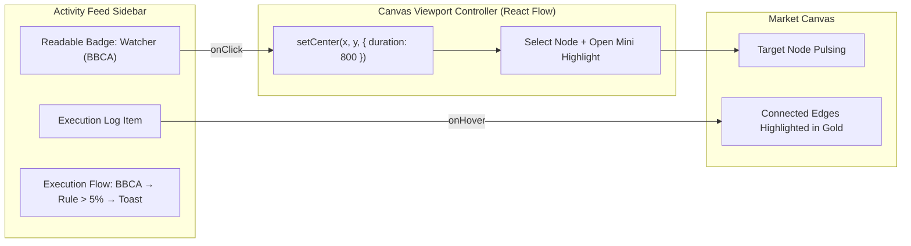

# Implementation Plan: Activity Feed Backtracking & Visual Canvas Flow

## Overview
Connect the **Activity Feed** to the **Market Canvas** by transforming raw card ID hashes (`card-a1b2`) into human-readable card badges, providing 1-click smooth camera pan & zoom directly to any triggered node, and visually illuminating the execution path across the canvas when hovering or selecting a log.

---

## Architecture & Components

---

## Proposed Changes & Phases

### Phase 1: Human-Readable Card Resolvers
- **Problem:** Currently, logs store node IDs (e.g. `node-ck01923`) and render generic text like `card-ck01`.
- **Solution:** 
  - Create a helper utility `resolveNodeLabel(node: CanvasNodeData)`:
    - **`watcher`** $\rightarrow$ `Watcher (${symbol})` (e.g. *Watcher (BBCA)*)
    - **`condition`** $\rightarrow$ `Rule (${rule})` (e.g. *Rule (> 5%)*)
    - **`note`** $\rightarrow$ `Sticky Note ("${snippet}")` (e.g. *Note (Watching momentum)*)
    - **`alert`** $\rightarrow$ `Alert (${channel})` (e.g. *Toast Notification*)
    - **`action`** $\rightarrow$ `Action (${action})` (e.g. *Create Child Note*)
  - Pass the active `canvas.nodes` list to `ActivityFeed` so each log item renders clear, color-coded node chips with their icon (MingCute icons).

### Phase 2: Click-to-Focus Pan & Zoom (`useReactFlow.setCenter`)
- **Problem:** Clicking a badge in the log currently does not move the camera to the node.
- **Solution:**
  - Expose a callback `onFocusNode(nodeId: string)` from `MarketCanvas` to parent / `ActivityFeed`.
  - In `MarketCanvas`, use React Flow's `setCenter(node.position.x + width/2, node.position.y + height/2, { zoom: 1.2, duration: 800 })`.
  - Set `selected: true` on the targeted node so its outline and handles immediately light up.

### Phase 3: Visual Execution Chain Glow & Hover Highlight
- **Problem:** Difficult to see which exact sequence of edges and cards ran during a past trigger.
- **Solution:**
  - Support `highlightedNodeIds: string[]` in canvas state.
  - When hovering over a log card in the Activity Feed:
    - Temporarily highlight all nodes in `log.triggeredNodes` with a pulsing ring animation (`ring-4 ring-indigo-500/50`).
    - Highlight all edges connecting these nodes in bright indigo (`stroke: #6366f1, strokeWidth: 4`).
  - When mouse leaves, return to standard view.

---

## User-Facing Benefits
1. **Instant Clarity:** Users immediately see *which* stock, rule, or sticky note was involved in each trigger.
2. **Effortless Navigation:** Clicking any badge smoothly flies the camera to that exact node, even on large canvas boards.
3. **Audit Trail Inspection:** Hovering over any past activity log visualizes the exact path the trigger took through your graph.

---

## Verification Plan
1. **Click-to-Pan Test:** Click on a watcher or sticky note badge in the Activity Feed and verify the canvas smoothly zooms and centers on that specific card.
2. **Label Accuracy Test:** Change a watcher ticker (e.g., from `BBCA` to `BBRI`) and verify the log badge updates with the new name.
3. **Execution Path Test:** Run a test simulation trigger; verify that all participating cards and connecting edges highlight as expected.
