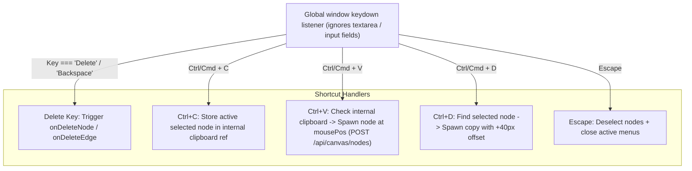

# Implementation Plan: Whiteboard Canvas Keyboard Shortcuts

## Overview
Add essential, standard whiteboard keyboard shortcuts to Scriffle canvas for fast manipulation of nodes and connectors without requiring right-click menus every time.

---

## Targeted Keyboard Shortcuts

| Shortcut | Action | Scope / Target |
| :--- | :--- | :--- |
| **`Delete` / `Backspace`** | Delete selected elements | Selected Node(s) or Connector(s) |
| **`Ctrl + C` / `Cmd + C`** | Copy selected node | Copies config & type to clipboard buffer |
| **`Ctrl + V` / `Cmd + V`** | Paste copied node | Spawns copied node at current mouse position (with +20px offset) |
| **`Ctrl + D` / `Cmd + D`** | Quick Duplicate | Immediately creates an exact duplicate next to the selected node |
| **`Escape`** | Deselect & Close Menus | Clears active selection and closes context menus / modals |

---

## Technical Architecture

---

## Detailed Implementation Steps

### 1. Guard against Input / Textarea Conflict
- When user is typing inside sticky notes, node text inputs, or modal forms (`event.target.tagName === 'INPUT' || 'TEXTAREA'`), standard editing keystrokes (like typing or deleting text) must **not** trigger canvas node deletion.

### 2. Node & Edge Deletion (`Delete` / `Backspace`)
- Wire React Flow's `onNodesDelete` and `onEdgesDelete` to call `onDeleteNode` and `onDeleteEdge`.
- Add active keyboard listener for explicitly selected nodes.

### 3. Copy & Paste (`Ctrl+C` / `Ctrl+V`)
- In `MarketCanvas.tsx`, maintain a `clipboardNodeRef` holding `{ type, config }`.
- On `Ctrl+C`: capture currently selected node's data.
- On `Ctrl+V`: convert current cursor position via `screenToFlowPosition` and create a new node with matching config.

### 4. Duplicate (`Ctrl+D`)
- On `Ctrl+D`: prevent default browser bookmark shortcut, find the selected node, calculate `position: { x: pos.x + 40, y: pos.y + 40 }`, and call `onAddNodeAtPosition`.

### 5. Quick Deselect (`Escape`)
- Clears `menu`, closes any open modals, and clears active selection.

---

## Verification Plan
1. **Delete Test:** Select a card or connector and press `Backspace` or `Delete`. Verify it is removed and synced with backend.
2. **Copy-Paste Test:** Select a card (e.g. Watcher or Sticky Note), press `Ctrl+C`, move cursor, press `Ctrl+V`. Verify a clone appears at the mouse position.
3. **Duplicate Test:** Select a card, press `Ctrl+D`. Verify an exact copy appears immediately offset from the original.
4. **Input Protection Test:** Type text inside a Sticky Note and press `Backspace` / `Ctrl+C` / `Ctrl+V`. Verify that the text edits normally without deleting or cloning the card.
