# Implementation Plan: Project Save & Open (`.scriffle` File Format)

## Overview
Enable users to export and import full Scriffle whiteboards as **`.scriffle`** project files (a formatted JSON schema). This allows users to save backups, share preset workflows, swap demo scenarios for E2E testing, and reload their research graphs with 1-click.

---

## 📄 `.scriffle` File Format Specification

A `.scriffle` file is a UTF-8 JSON file containing metadata, schema versioning, canvas nodes, edges, and optional snapshots:

```json
{
  "format": "scriffle",
  "version": "1.0.0",
  "name": "IDX Bluechips Breakout Tracker",
  "createdAt": "2026-09-05T00:26:00.000Z",
  "nodes": [
    {
      "id": "node-1",
      "type": "watcher",
      "position": { "x": 120, "y": 200 },
      "config": {
        "symbol": "BBCA",
        "metric": "price_change",
        "interval": 300
      }
    },
    {
      "id": "node-2",
      "type": "note",
      "position": { "x": 450, "y": 200 },
      "config": {
        "content": "Watching BBCA sector momentum...",
        "color": "yellow",
        "width": 300,
        "height": 180
      }
    }
  ],
  "edges": [
    {
      "id": "edge-1",
      "from": "node-1",
      "to": "node-2"
    }
  ]
}
```

---

## 🏗️ Architecture & Flow

```mermaid
flowchart TD
    subgraph TopNav ["Top Navigation Bar"]
        SaveBtn["Save as .scriffle"]
        OpenBtn["Open .scriffle"]
        HiddenInput["<input type='file' accept='.scriffle,.json' />"]
    end

    subgraph Client ["Client State & Engine"]
        ExportHandler["Export: Serialize canvasData to JSON Blob & trigger browser download"]
        ImportHandler["Import: FileReader -> JSON.parse -> Validate -> POST /api/canvas/restore"]
    end

    subgraph Backend ["Backend API (/api/canvas/restore)"]
        Validator["Schema & Node ID Remap Validator"]
        PrismaTx["Prisma Transaction: Clean wipe old canvas nodes & insert imported graph"]
    end

    SaveBtn -->|onClick| ExportHandler
    OpenBtn -->|onClick| HiddenInput
    HiddenInput -->|onChange| ImportHandler
    ImportHandler -->|POST payload| Backend
    Backend -->|200 OK| SWRMutate["mutate() Canvas & Activity Feed"]
```



---

## 🚀 Proposed Implementation Phases

### Phase 1: Backend Restore / Import API (`/api/canvas/restore`)
- **Route:** `POST /api/canvas/restore`
- **Responsibilities:**
  1. Validate incoming JSON (`format: "scriffle"` or standard schema).
  2. Perform a clean atomic Prisma transaction:
     - Clear existing canvas nodes and edges.
     - Insert imported nodes with their `position`, `type`, and `configJson`.
     - Reconnect edges referencing the node IDs.
     - Reset cycle counters to 0 to ensure a fresh, clean simulation state.
  3. Return updated canvas data.

### Phase 2: Client Export & Import Engine
- **Save Project (`handleSaveScriffle`):**
  - Extract current canvas state (`canvas.name`, `nodes`, `edges`).
  - Convert to pretty-printed JSON string.
  - Create a `Blob` (`application/json`) and trigger an automatic browser download named `<canvas_name>.scriffle`.
  - Display success toast: *"Project Saved: <canvas_name>.scriffle"*.
- **Open Project (`handleOpenScriffle`):**
  - Open native file picker accepting `.scriffle, .json`.
  - Read file via `FileReader.readAsText`.
  - Parse and validate structure.
  - Send to `POST /api/canvas/restore`.
  - Trigger SWR `mutate()` to immediately paint the restored canvas without page reload.
  - Display toast: *"Project Restored: Loaded X cards and Y connectors"*.

### Phase 3: Top Navigation UI Integration
- Add clean, flat outline buttons in [`TopNav.tsx`](file:///home/abzolute/Projects/hackathon/src/components/controls/TopNav.tsx):
  - **Open Project** (with `folder_open_line` MingCute icon).
  - **Save Project** (with `download_2_line` / `save_line` MingCute icon).
  - Editable Canvas Title so users can name their project before saving.

### Phase 4: Bundled Starter Presets
- Create a `presets/` folder in the project with 2 ready-to-test `.scriffle` files:
  1. `presets/idx_momentum_breakout.scriffle`
  2. `presets/banking_sector_watcher.scriffle`
- Allows instant 1-click loading during demos and E2E testing.

---

## 🛡️ Validation & Safety Guards
1. **Corrupt File Protection:** If an invalid file is uploaded, catch parse errors, reject the import, and show an error toast: *"Invalid .scriffle file format"*.
2. **Missing Nodes Protection:** Ensure all edges connect to valid nodes present in the file before committing to database.
3. **Overwriting Prompt (Optional / Safe Undo):** Ensure import smoothly replaces canvas state without crashing or leaving dangling foreign keys.

---

## 🧪 Verification Plan
1. **Save Test:** Create 3 nodes and 2 connections, click **Save as .scriffle**, verify download of `Scriffle_Project.scriffle`.
2. **E2E Import Test:** Clear canvas or delete nodes, click **Open .scriffle**, select the downloaded file, verify canvas restores identically.
3. **Preset Test:** Load `idx_momentum_breakout.scriffle` and trigger `Simulate BBCA Surge` to verify graph runs seamlessly.
