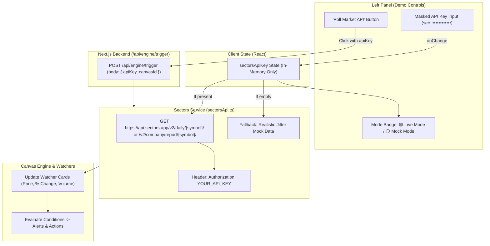

# Implementation Plan: Sectors API Key Management & Live Watcher Polling

## Overview
Enable users to enter a Sectors API key in the left **Demo Controls** panel to toggle Scriffle between **Online (Live Sectors API v2)** and **Offline (Simulated Mock Data)**. The API key is stored strictly in client session state (temporary, masked by default, and never persisted to database or exported `.scriffle` files).

---

## 🏗️ Architecture & Data Flow

---

## 🎯 Key Objectives & Requirements

1. **Security & Privacy Micro-Banner (User-Facing Guarantee):**
   - Place a reassuring info badge right under the API key input:
     - 🛡️ *"Your key is kept in-memory for this session only. It is never saved to a database, sent to third parties, or included in `.scriffle` exports."*
2. **Temporary & Safe Key Storage:**
   - Kept in client React state (`useState`), wiped automatically on browser refresh or project close.
   - Excluded from all `.scriffle` JSON export payloads so sharing whiteboards never leaks keys.
   - Input is masked (`type="password"`) with an eye toggle (`eye_line` / `eye_close_line`) to view/edit.
3. **Dynamic Mode Indicator:**
   - Displays `🟢 Live Mode (Sectors v2)` when a valid key is entered.
   - Displays `⚪ Mock / Offline Mode` when no key is entered.
4. **Live Watcher Polling (`POST /api/engine/trigger`):**
   - When the user clicks **"Poll Market API"**, the frontend sends `{ apiKey, canvasId }` in the POST body.
   - Backend scans the canvas for all active Watcher tickers (`BBCA`, `BBRI`, `BMRI`, `TLKM`, etc.).
   - Fetches live data via `https://api.sectors.app/v2/company/report/{symbol}/` (or `daily/{symbol}/`).
   - Normalizes response fields (`price`, `prevPrice`, `price_change`, `volume`, `avg_volume`).
   - Updates `MarketSnapshot` and executes the graph engine (`executeGraphForEvent`).
   - Revalidates SWR so watcher cards reflect live Indonesian stock prices immediately.
4. **Preserve Offline Simulation Tools:**
   - The manual spike presets (`BBCA Surge (+6.37%)`, `BBRI Volume Spike`) and continuous stream loop remain available for offline demos without burning API credits.

---

## 📋 Proposed Implementation Phases

### Phase 1: Upgrade Backend Sectors Service (`src/server/services/sectorsApi.ts`)
- Change base URL to `https://api.sectors.app/v2`.
- Update `getMarketDataForSymbol(symbol: string, apiKey?: string)`:
  - If `apiKey` provided (or `process.env.SECTORS_API_KEY` exists), call:
    - `GET https://api.sectors.app/v2/daily/${upperSymbol}/` (or `/v2/company/report/${upperSymbol}/`).
    - Use header: `Authorization: ${apiKey}`.
  - Parse v2 JSON payload and calculate accurate `price`, `prevPrice`, and `price_change`.
  - Handle rate limits / 401 Unauthorized gracefully with error logging.
  - If no key is provided, return simulated mock data.
- Update `syncMarketSnapshots(symbols: string[], apiKey?: string)` to pass `apiKey` through.

### Phase 2: Update Engine Trigger Route (`src/app/api/engine/trigger/route.ts`)
- Accept `apiKey` from `req.json()` body.
- Pass `apiKey` to `syncMarketSnapshots(symbols, apiKey)`.
- Return detailed response showing whether real data or mock data was returned.

### Phase 3: Left Panel UI Integration (`src/components/controls/SimulationBar.tsx`)
- Add an **API Key & Data Source** section at the top of the Demo Controls panel:
  - Password input field with placeholder `"Enter Sectors API Key (sec_...)"`.
  - Show/Hide toggle button using MingCute icons (`eye_line` / `eye_close_line`).
  - Clear button (`close_circle_line`) to easily reset to Mock mode.
  - Mode Pill Badge: `🟢 Live Sectors v2` vs `⚪ Simulated Mock`.
  - **Security & Privacy Guarantee Micro-Badge:**
    - Visual shield callout (`shield_shape_line`) with copy: *"Session only. Your API key is stored in temporary browser memory, never written to disk, and never included in project file exports."*
- Connect **"Poll Market API"** button to pass the active API key.

### Phase 4: State Wiring in `page.tsx`
- Maintain `sectorsApiKey` in `page.tsx` React state.
- Pass `sectorsApiKey` and `onApiKeyChange` to `<SimulationBar />`.
- Show toast feedback on successful live poll (e.g. *"Market Polled (Live): Fetched 3 tickers from Sectors API"*).

---

## 🧪 Verification & Testing Plan
1. **Masking & Safety Test:** Enter an API key, toggle visibility on/off, verify input masks properly. Save project as `.scriffle` and inspect JSON to ensure the key is **NOT** exported.
2. **Mock Mode Fallback Test:** Clear API key, click **Poll Market API**, verify simulated values are returned without error.
3. **Live Sectors API Test:** Enter a valid Sectors API key, click **Poll Market API**, verify real IDX price and volume populate on the Watcher nodes on canvas.
4. **Downstream Rule Trigger Test:** With live data, verify that a condition rule (e.g. `price_change > 0`) triggers connected alerts and actions as expected.
