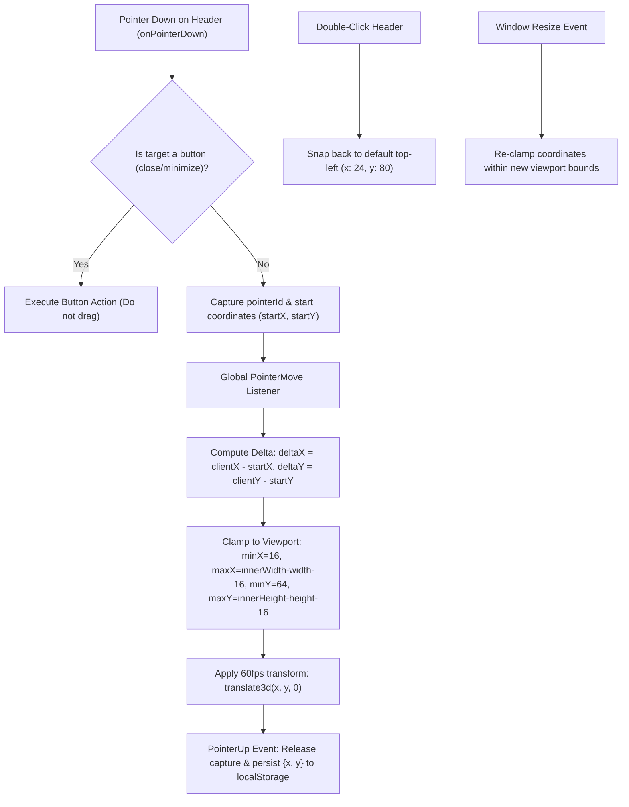

# 📋 Implementation Plan: Draggable Sandbox Missions Card & Single-Line Spotlight Modal Actions

> **Feature Type:** Canvas UX, Floating Widget Drag Architecture & Onboarding Polish  
> **Status:** Proposed Implementation Plan  
> **Objective:** 
> 1. Fix the Step 6 Spotlight Popover ("Ready to Build?") width and button constraints to strictly guarantee 1-liner buttons (`whitespace-nowrap`) with zero wrapping.
> 2. Transform the floating **Sandbox Missions Card** (`SandboxMissionsCard.tsx`) into a smooth, hardware-accelerated draggable/movable widget with boundary clamping, viewport resize safety, double-click reset, and position persistence.

---

## 1. Problem Analysis & Root Cause

### A. Step 6 Spotlight Modal Width & Multi-Line Buttons (`TourCardPopover.tsx`)
- **Root Cause**: 
  - On Step 6 ("Ready to Build?"), the popover footer contains the **Back button**, **6 Step indicator dots**, **"Explore Freely" button**, and the **"Start Missions" button** (with icon + text), plus the *"Don't show this on startup"* toggle checkbox.
  - The card width was constrained to `w-[420px]` (with `cardWidth = 400` in coordinate calculations).
  - In `420px`, the combined width of the three buttons and step dots exceeds the horizontal space, forcing the action buttons to wrap onto two lines.
- **Solution**:
  - Increase card width to `w-[480px]` (or adaptive `w-[480px]` for Step 6).
  - Enforce `whitespace-nowrap shrink-0` on all button labels and containers.
  - Update `calculatePosition()` in `TourCardPopover.tsx` with `cardWidth = 480` for accurate viewport edge clamping.

---

### B. Draggable & Movable Sandbox Missions Card (`SandboxMissionsCard.tsx`)
- **Root Cause**:
  - The Sandbox checklist card is currently hardcoded with static CSS `fixed top-20 left-6 z-30`.
  - When users build complex graphs on the top-left area of the whiteboard (e.g. placing Watcher and Screener cards), the fixed checklist card can obscure active nodes or connector handles.
  - Users need the ability to effortlessly grab the header bar and move the checklist to any corner of the screen without accidentally panning the underlying React Flow canvas.

---

## 2. Draggable Widget Architecture & UX Mechanics

---

## 3. Technical Specifications

### A. Position Store & `localStorage` Schema

| Key | Type | Default | Description |
| :--- | :--- | :--- | :--- |
| `scriffle_sandbox_card_pos_v1` | `{ x: number; y: number }` | `{ x: 24, y: 80 }` | Stores last user-dragged coordinate on screen. |

### B. Drag Handle & Gesture Engine (`useDraggableWidget` / Direct Hook)

1. **Header Drag Handle**:
   - Header element styled with `cursor-grab active:cursor-grabbing select-none`.
   - Action buttons (minimize/close) include `e.stopPropagation()` and `nodrag` class to prevent initiating a drag when clicking buttons.
2. **Pointer Capture**:
   - `e.currentTarget.setPointerCapture(e.pointerId)` ensures uninterrupted tracking even if the cursor moves rapidly across iframes or off the card.
3. **Viewport Boundary Clamping**:
   - Horizontal bounds: `Math.max(16, Math.min(x, window.innerWidth - cardWidth - 16))`.
   - Vertical bounds: `Math.max(64, Math.min(y, window.innerHeight - cardHeight - 16))` (reserves top 64px for `TopNav`).
4. **React Flow Isolation**:
   - Card container has `nodrag nowheel nopan` classes so dragging or scrolling the checklist never interacts with React Flow canvas pan/zoom.
5. **Smooth Hardware Acceleration**:
   - Coordinates applied via `style={{ transform: \`translate3d(\${pos.x}px, \${pos.y}px, 0)\` }}` with `will-change: transform` during active drag for 60fps fluidity.
6. **Reset on Double-Click**:
   - Double-clicking the header bar immediately animates back to default `{ x: 24, y: 80 }` with smooth transition.

---

## 4. Step-by-Step Implementation Tasks

| # | File | Action | Details |
|---|---|---|---|
| **1** | `src/components/onboarding/TourCardPopover.tsx` | Modify | Increase card width to `w-[480px]`, update `cardWidth = 480` in position calculation, and enforce `whitespace-nowrap shrink-0` across all footer button elements. |
| **2** | `src/components/tutorial/SandboxMissionsCard.tsx` | Modify | Implement stateful pointer-drag system on header with viewport clamping, persistence in `localStorage`, double-click reset, and hardware-accelerated transform. |
| **3** | `src/__tests__/unit/draggableWidget.test.ts` | Create | Unit test suite verifying boundary clamping math, coordinate persistence, default fallback, and double-click reset calculations. |

---

## 5. User Experience Walkthrough

1. **Spotlight Tour Step 6 ("Ready to Build?")**:
   - Popover card appears with generous 480px width.
   - All three footer actions (`Back`, `Explore Freely`, `Start Missions 🎯`) sit comfortably on a **single line** with crisp spacing and no wrapping.
2. **Opening the Sandbox Missions Card**:
   - Checklist card appears at `{ x: 24, y: 80 }` (or user's saved position).
   - Hovering the header shows a grab hand `cursor-grab`.
3. **Dragging the Card**:
   - Presenter/analyst clicks and drags the header anywhere across the screen.
   - The card glides smoothly and cannot be dragged offscreen.
   - Releasing the mouse saves the position.
4. **Resetting Position**:
   - Double-clicking the header bar snaps the card right back to `{ x: 24, y: 80 }`.

---

## 6. Verification & Validation Plan

1. **Visual & Layout Check**:
   - Launch Step 6 in the Spotlight Tour $\rightarrow$ verify all buttons are strictly single-line.
2. **Draggable Interaction Check**:
   - Drag Sandbox card to top-right, bottom-right, center $\rightarrow$ verify smooth 60fps tracking.
   - Verify minimize/close buttons still work on click without dragging.
   - Reload browser $\rightarrow$ verify card re-appears in the saved custom position.
   - Double-click header $\rightarrow$ verify card snaps back to top-left.
3. **Automated Unit Tests**:
   - Run `bun test` to ensure all 23+ test suites pass with 100% green status.
