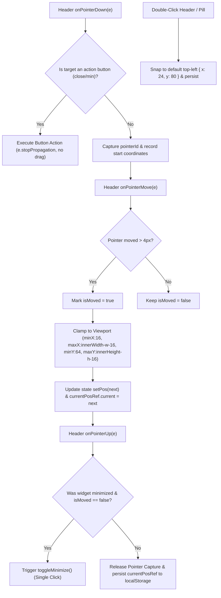

# 📋 Implementation Plan: Draggable Sandbox Missions Card Fix

> **Feature Type:** Canvas UX, Floating Widget Drag Architecture & Bug Fix  
> **Status:** Proposed Implementation Plan  
> **Target Files:**
> - `src/components/tutorial/SandboxMissionsCard.tsx`
> - `src/__tests__/unit/draggableWidget.test.ts`
> - `context/BACKLOG.md`

---

## 1. Problem Statement & Root Cause Analysis

### A. The Core Freeze Bug (`target.closest('.nodrag')`)
- **Observed Symptom**: When hovering over the header of the Sandbox Missions card, the cursor correctly changes to `cursor-grab` (and `cursor-grabbing` on mousedown), but dragging the mouse has zero effect on the card position.
- **Root Cause**:
  1. The top-level container `<div ref={cardRef}>` includes the class `nodrag` (alongside `nowheel nopan`) to prevent React Flow's canvas engine from intercepting mouse interactions inside the floating widget.
  2. The header's `handlePointerDown` handler contained:
     ```tsx
     const target = e.target as HTMLElement;
     if (target.closest('button') || target.closest('.nodrag')) return;
     ```
  3. When the user clicks the header bar, `target.closest('.nodrag')` checks the DOM ancestry and matches the top-level container `<div ref={cardRef} className="... nodrag ...">`.
  4. Because `target.closest('.nodrag')` evaluates to truthy on every header click, `handlePointerDown` immediately returns on line 88 without setting `isDragging = true` or capturing the pointer ID.

---

### B. Minimized Pill Dragging vs. Click Expand
- **Observed Symptom**: In minimized mode (`isMinimized = true`), the entire pill is rendered as a `<button onClick={toggleMinimize}>`.
- **Root Cause**:
  1. Any click or drag on the minimized pill originates from `<button>` or a child element.
  2. Checking `target.closest('button')` blocks the drag gesture completely, making the minimized pill immovable.
  3. Conversely, removing the button check would cause every drag attempt to also toggle minimize upon release.
- **Solution**: Implement pointer distance threshold tracking (`isMovedRef` / `dragDistance >= 5px`):
  - Pointer down records start coordinates.
  - Pointer move updates position if dragged $\ge 4\text{px}$.
  - Pointer up checks if movement occurred: if movement $< 4\text{px}$, fire `toggleMinimize()`; if moved, persist the new position and suppress expand.

---

### C. Stale State Persistence in `localStorage`
- **Observed Symptom**: Dragging rapid successive motions could save stale coordinates to `localStorage` due to React state closure timing in `handlePointerUp`.
- **Root Cause**: `handlePointerUp` references `pos` directly from the component scope rather than an active mutable ref (`currentPosRef.current`).
- **Solution**: Maintain `currentPosRef.current` updated synchronously on every `pointermove` event and read `currentPosRef.current` inside `handlePointerUp` before saving to `localStorage`.

---

## 2. Architecture & Data Flow



---

## 3. Detailed Technical Specifications

### A. Drag State & Ref Schema in `SandboxMissionsCard.tsx`

```typescript
const [pos, setPos] = useState<{ x: number; y: number }>(DEFAULT_SANDBOX_POS);
const [isDragging, setIsDragging] = useState<boolean>(false);
const cardRef = useRef<HTMLDivElement>(null);
const currentPosRef = useRef<{ x: number; y: number }>(DEFAULT_SANDBOX_POS);
const isMovedRef = useRef<boolean>(false);
const dragStartRef = useRef<{
  startX: number;
  startY: number;
  initialX: number;
  initialY: number;
}>({
  startX: 0,
  startY: 0,
  initialX: DEFAULT_SANDBOX_POS.x,
  initialY: DEFAULT_SANDBOX_POS.y,
});
```

### B. Pointer Event Handlers

1. **`handlePointerDown`**:
   ```typescript
   const handlePointerDown = (e: React.PointerEvent<HTMLDivElement>) => {
     if (e.button !== 0) return;
     const target = e.target as HTMLElement;
     
     // Only block explicit action buttons (close / minimize inside expanded header)
     if (target.closest('[data-no-drag="true"]') || target.closest('.no-drag-handle')) {
       return;
     }

     setIsDragging(true);
     isMovedRef.current = false;
     dragStartRef.current = {
       startX: e.clientX,
       startY: e.clientY,
       initialX: pos.x,
       initialY: pos.y,
     };

     try {
       e.currentTarget.setPointerCapture(e.pointerId);
     } catch {}
   };
   ```

2. **`handlePointerMove`**:
   ```typescript
   const handlePointerMove = (e: React.PointerEvent<HTMLDivElement>) => {
     if (!isDragging) return;
     const dx = e.clientX - dragStartRef.current.startX;
     const dy = e.clientY - dragStartRef.current.startY;

     if (Math.abs(dx) > 3 || Math.abs(dy) > 3) {
       isMovedRef.current = true;
     }

     const width = cardRef.current?.offsetWidth || (isMinimized ? 220 : 360);
     const height = cardRef.current?.offsetHeight || (isMinimized ? 44 : 400);
     const next = clampPosition(
       dragStartRef.current.initialX + dx,
       dragStartRef.current.initialY + dy,
       width,
       height
     );

     currentPosRef.current = next;
     setPos(next);
   };
   ```

3. **`handlePointerUp`**:
   ```typescript
   const handlePointerUp = (e: React.PointerEvent<HTMLDivElement>) => {
     if (!isDragging) return;
     setIsDragging(false);

     try {
       if (e.currentTarget.hasPointerCapture(e.pointerId)) {
         e.currentTarget.releasePointerCapture(e.pointerId);
       }
     } catch {}

     // Persist final position
     try {
       localStorage.setItem(SANDBOX_POS_STORAGE_KEY, JSON.stringify(currentPosRef.current));
     } catch {}

     // If in minimized mode and didn't drag, treat as click to expand
     if (isMinimized && !isMovedRef.current) {
       toggleMinimize();
     }
   };
   ```

4. **`handleDoubleClickHeader`**:
   ```typescript
   const handleDoubleClickHeader = (e: React.MouseEvent) => {
     e.stopPropagation();
     const defaultClamped = clampPosition(DEFAULT_SANDBOX_POS.x, DEFAULT_SANDBOX_POS.y);
     currentPosRef.current = defaultClamped;
     setPos(defaultClamped);
     try {
       localStorage.setItem(SANDBOX_POS_STORAGE_KEY, JSON.stringify(defaultClamped));
     } catch {}
   };
   ```

---

## 4. Step-by-Step Implementation Checklist

| # | Task | Target File | Action |
|---|---|---|---|
| **1** | Refactor Pointer Event Handlers & State Refs | `src/components/tutorial/SandboxMissionsCard.tsx` | Remove `target.closest('.nodrag')` check. Add `currentPosRef` and `isMovedRef`. Use `[data-no-drag="true"]` on header action buttons. |
| **2** | Support Minimized Pill Drag & Click Separation | `src/components/tutorial/SandboxMissionsCard.tsx` | Wrap minimized pill in pointer-drag handlers, allowing dragging to reposition and tapping/clicking to expand. |
| **3** | Extend Unit Test Coverage | `src/__tests__/unit/draggableWidget.test.ts` | Add tests verifying drag distance classification (drag vs click), pointer capture safety, and coordinate clamping across card states. |
| **4** | Update Backlog Status | `context/BACKLOG.md` | Mark Draggable Sandbox fix as resolved with complete unit test verification. |

---

## 5. Verification & Acceptance Criteria

1. **Header Dragging**:
   - Grab the expanded Sandbox Missions card header $\rightarrow$ card follows pointer smoothly in real time across the canvas.
   - Releasing the card keeps it at the release coordinates and survives page reload.
2. **Action Button Isolation**:
   - Clicking the minimize (`down_line`) or close (`close_line`) buttons does not trigger a drag and properly executes the button action.
3. **Minimized Pill Interaction**:
   - Single-clicking the minimized pill toggles it open.
   - Dragging the minimized pill moves it across the screen without expanding it on release.
4. **Boundary Clamping & Reset**:
   - The card cannot be dragged past viewport edges or above the 64px TopNav bar.
   - Double-clicking the header or pill snaps it immediately back to `{ x: 24, y: 80 }`.
