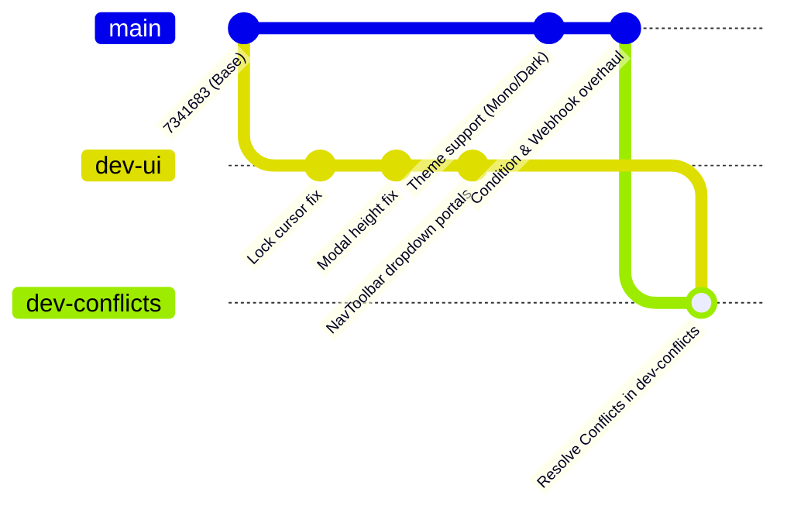

# Implementation Plan: Resolving Git Conflicts between `dev-ui` and `dev-conflicts`

## 1. Overview & Context

- **Current Working Branch**: `dev-conflicts` (safe branch to perform and verify changes before merging into `main`).
- **Base / Upstream State**: `dev-conflicts` is synchronized with `main` and `origin/dev` (commit `ba11e55`), containing recent features such as:
  - Custom themes support (Default Light, Dark, Mono) across controls and canvas.
  - Dual-output Condition Nodes (`True`/`False` paths).
  - Discord Webhooks & Quick Add connector enhancements.
- **Source Feature Branch**: `dev-ui` (contains 5 commits diverged from base commit `7341683`):
  - `2dbfecc` / `fd4c8d7`: Canvas locked state interaction guards and cursor consistency.
  - `fac5a42`: Modal body max-height and scrolling overflow boundaries in [EditNodeModal.tsx](file:///home/eiksirf/Projects/scriffle/src/components/controls/EditNodeModal.tsx).
  - `4e298f1`: Floating Insert & Sticker dropdown menus rendered via React `createPortal` in [NavToolbar.tsx](file:///home/eiksirf/Projects/scriffle/src/components/controls/NavToolbar.tsx).

---

## 2. Integration Architecture & Strategy



### Safety Rules
1. **Never merge directly into `main`** until fully verified in `dev-conflicts`.
2. All resolutions must **preserve features from both branches** without overwriting theme tokens or portal dropdown logic.

---

## 3. Step-by-Step Resolution Plan

### Phase 1: Git Merge Trigger
On branch `dev-conflicts`:
```bash
git checkout dev-conflicts
git merge dev-ui
```

### Phase 2: File-by-File Conflict Resolutions

#### 1. [NavToolbar.tsx](file:///home/eiksirf/Projects/scriffle/src/components/controls/NavToolbar.tsx)
- **Conflicts**: Dropdown menu portal structure and `isLocked` guard button styling vs theme class utility definitions (`isDark`, `isMono`, `creationButtonClass`, `dropdownPanelClass`, `dropdownMenuItemClass`).
- **Resolution**:
  - Keep `createPortal` dropdowns for Insert and Sticker menus from `dev-ui`.
  - Keep `isLocked` disabled attributes and title helpers.
  - Retain the Alert and Action node buttons added in `dev-conflicts`.
  - Apply dynamic theme classes (`dropdownPanelClass`, `dropdownMenuItemClass`, `creationButtonClass`) to all buttons and portals.

#### 2. [EditNodeModal.tsx](file:///home/eiksirf/Projects/scriffle/src/components/controls/EditNodeModal.tsx)
- **Conflicts**: Form body height boundaries and overflow scrolling vs new theme tokens and Discord/Condition options.
- **Resolution**:
  - Merge the max-height and scrolling constraints (`max-h-[60vh] overflow-y-auto`) from `dev-ui` into the updated modal body containers.
  - Maintain the theme styles (`isDark`, `isMono`) and newly added node configuration panels.

#### 3. [MarketCanvas.tsx](file:///home/eiksirf/Projects/scriffle/src/components/canvas/MarketCanvas.tsx)
- **Conflicts**: Canvas cursor styling when canvas is locked vs latest handle/theme updates.
- **Resolution**:
  - Ensure the cursor class `cursor-not-allowed` / locked pointer event logic from `dev-ui` is applied to the root canvas container while preserving the latest handle connections.

#### 4. Context & Documentation ([BACKLOG.md](file:///home/eiksirf/Projects/scriffle/context/BACKLOG.md), [CHECKPOINT.md](file:///home/eiksirf/Projects/scriffle/context/CHECKPOINT.md), [SESSION_CHANGELOG.md](file:///home/eiksirf/Projects/scriffle/context/SESSION_CHANGELOG.md))
- **Resolution**: Combine completed tasks from both branches into unified documentation.

---

## 4. Verification & Testing Checklist

- [ ] **Type Check & Build**:
  ```bash
  npm run build
  ```
- [ ] **Dropdown Portals**: Verify Insert (Sticky Note, Text, Image, File) and Sticker menus open and close smoothly without clipping inside [NavToolbar.tsx](file:///home/eiksirf/Projects/scriffle/src/components/controls/NavToolbar.tsx).
- [ ] **Theme Switching**: Toggle Light, Dark, and Mono themes; check that dropdown menus and toolbar buttons reflect the active theme.
- [ ] **Canvas Lock**: Toggle canvas lock; ensure node creation buttons in toolbar and canvas drag interactions are disabled with appropriate cursor feedback.
- [ ] **Node Editing**: Open [EditNodeModal.tsx](file:///home/eiksirf/Projects/scriffle/src/components/controls/EditNodeModal.tsx) on Alert, Condition, and Action nodes; confirm scrollbars and content fit within viewport boundaries.

---

## 5. Post-Verification Merge into Main

Once tested and confirmed in `dev-conflicts`:
```bash
git checkout main
git merge dev-conflicts
git push origin main
```
