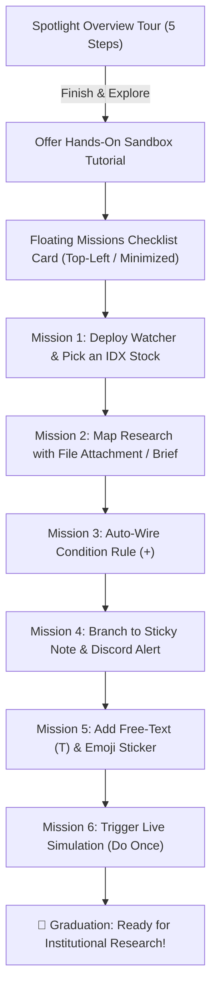

# 📋 Implementation Plan: Interactive Step-by-Step Hands-On Sandbox Missions

> **Feature Type:** Post-Spotlight Interactive Guided Missions & Canvas Element Walkthrough  
> **Status:** ✅ Completed & Tested (100% Green, 215 tests across 21 suites)  
> **Objective:** Teach new users how to actively use every element and workflow in Scriffle through progressive, hands-on tasks that detect real user canvas actions — including mapping research documents alongside live automation pipelines.

---

## 1. Vision & Mental Model

While the **Spotlight Onboarding Tour** provides a 45-second visual overview of the whiteboard, the **Hands-On Sandbox Missions** turn passive viewers into active builders.

A key misconception among new users is thinking **File cards are only for automated export outputs**. In Scriffle, `FileNode` is an integral **first-class research mapping tool**: analysts can attach company filings, broker research PDFs, earnings presentations, and financial spreadsheets directly onto the whiteboard to anchor their thesis alongside live event-driven tickers.



---

## 2. The 6 Hands-On Missions

Each mission tracks **live canvas events and state mutations** to automatically check off items in real time.

| Mission # | Task Title | Goal / User Action | Detection Mechanism | Why This Matters & Next Prompt |
| :--- | :--- | :--- | :--- | :--- |
| **01** | **Deploy Watcher & Pick a Stock** | Drop a Watcher card from the toolbar and choose an Indonesian stock (e.g. `BBCA`, `BMRI`, `TLKM`) using the curated search combobox. | Node created with `type === 'watcher'` and `config.symbol` is non-empty. | Teaches zero-friction search across 150+ IDX stocks without needing to memorize tickers. |
| **02** | **Map Research with a File Card** | Drop a **File Attachment** from the toolbar or attach a research PDF / annual report to map your thesis on the board. | Node created with `type === 'file'`. | **Dispels the "export-only" myth**: teaches that files anchor external evidence (PDFs, filings, models) directly on the whiteboard. |
| **03** | **Auto-Wire a Condition Rule** | Hover the Watcher's output handle and click the floating **`[+]`** button to create a connected **Condition Node** (`price_change > 2`). | Edge created from `watcher` $\rightarrow$ `condition`. | Teaches flow building and non-overlapping auto-placement in 1 click. |
| **04** | **Branch to a Note or Discord Alert** | Connect the **`True`** (Emerald green) output handle to spawn an auto-interpolating **Sticky Note** or **Discord Alert**. | Edge created from `condition` $\rightarrow$ `note` or `alert`. | Teaches dual True/False branching and multi-channel alert delivery. |
| **05** | **Add Freeform Annotation** | Press **`T`** to drop rich freeform text or drop an inline **Emoji Sticker** (`🚀 Breakout`). | Node created with `type === 'text' \| 'sticker'`. | Teaches FigJam-style flexible whiteboard markup and visual tagging. |
| **06** | **Run Market Simulation** | Open the **Control Panel** on the left and click **`Do Once`** to simulate a live market tick and watch notes auto-update. | Execution trigger event logged in `logs` or `runCount > 0`. | 🎉 The "Aha! Moment" — seeing the entire graph evaluate live! |

---

## 3. UI/UX Component Architecture

```
src/
├── context/
│   └── SandboxTutorialContext.tsx     <-- Mission progress state store & canvas event listener
├── components/
│   └── tutorial/
│       ├── SandboxMissionsCard.tsx     <-- Floating 2px flat outline checklist widget (draggable/dockable)
│       ├── MissionStepItem.tsx         <-- Individual task with interactive checkmark, tips & badges
│       ├── InteractivePointerHint.tsx  <-- Subtle animated beacon pointing to target button/handle
│       ├── CompletionCelebration.tsx   <-- Institutional graduation banner / confetti pill
│       └── sandboxMissionsConfig.ts    <-- 6 mission definitions, action descriptions, target selectors
└── components/
    ├── controls/
    │   ├── TopNav.tsx                  <-- Add "Interactive Tutorial" launcher in Help menu
    │   ├── SpotlightSearchModal.tsx    <-- Add "Start Hands-On Missions" command
    │   └── ShortcutsModal.tsx          <-- Add "Interactive Tutorial" button
```

---

## 4. Detailed Component Specifications

### A. State Store (`SandboxTutorialContext.tsx`)

```typescript
export interface Mission {
  id: string;
  title: string;
  shortDesc: string;
  hint: string;
  targetTourTag?: string;
  isCompleted: boolean;
  completedAt?: string;
}

export interface SandboxTutorialState {
  isOpen: boolean;
  isMinimized: boolean;
  activeMissionId: string;
  missions: Mission[];
  completedCount: number;
  totalMissions: number;
  openTutorial: () => void;
  closeTutorial: () => void;
  toggleMinimize: () => void;
  resetMissions: () => void;
  checkMissionProgress: (canvas: CanvasData, logs: LogEntry[]) => void;
}
```

### B. Live Action Auto-Detection Logic

The context subscribes to canvas state changes from `useCanvasSync`:

1. **Mission 1 (Watcher & Stock)**:
   ```typescript
   const hasWatcherWithStock = canvas?.nodes?.some(
     (n) => n.type === 'watcher' && n.config?.symbol && n.config.symbol.trim().length > 0
   );
   ```

2. **Mission 2 (Research File Attachment)**:
   ```typescript
   const hasFileNode = canvas?.nodes?.some((n) => n.type === 'file');
   ```

3. **Mission 3 (Watcher $\rightarrow$ Condition Edge)**:
   ```typescript
   const hasWatcherToConditionEdge = canvas?.edges?.some((e) => {
     const source = canvas.nodes.find((n) => n.id === e.from);
     const target = canvas.nodes.find((n) => n.id === e.to);
     return source?.type === 'watcher' && target?.type === 'condition';
   });
   ```

4. **Mission 4 (Condition $\rightarrow$ Note / Alert)**:
   ```typescript
   const hasConditionToNoteOrAlert = canvas?.edges?.some((e) => {
     const source = canvas.nodes.find((n) => n.id === e.from);
     const target = canvas.nodes.find((n) => n.id === e.to);
     return source?.type === 'condition' && (target?.type === 'note' || target?.type === 'alert');
   });
   ```

5. **Mission 5 (Text or Sticker Annotation)**:
   ```typescript
   const hasAnnotationNode = canvas?.nodes?.some(
     (n) => n.type === 'text' || n.type === 'sticker' || n.type === 'image'
   );
   ```

6. **Mission 6 (Engine Execution / Poll)**:
   ```typescript
   const hasTriggeredExecution = (logs && logs.length > 0) || canvas?.nodes?.some(
     (n) => (n.state as any)?.runCount > 0 || (n.state as any)?.cycleCount > 0
   );
   ```

---

## 5. Design & Styling System Alignment

* **Widget Layout**: Docked at top-left (`top-20 left-6 z-30`), collapsible into a compact pill `[🎯 Tutorial: 3/6 Tasks]`.
* **Flat Outline System**: 2px solid borders (`border-slate-300`, `border-slate-800`), zero drop shadows (`shadow-none`).
* **Typography**: Clean `Stack Sans Text` — sentence case only, no uppercase or spaced letters.
* **4-Theme Support**:
  * **Light**: `bg-white border-slate-300 text-slate-900`
  * **Mono**: `bg-[#FCFBF9] border-[#D8D4CA] text-[#242321]`
  * **Dark**: `bg-[#14151B] border-[#282A36] text-[#E2E4E9]`
  * **Custom**: `bg-[var(--custom-ui-surface)] border-[var(--custom-ui-border)] text-[var(--custom-ui-text)]`

---

## 6. Implementation Roadmap

1. **Step 1: Mission Definitions & State Engine**
   - Create `src/components/tutorial/sandboxMissionsConfig.ts` with 6 mission objects (including research file mapping), tips, and target tags.
   - Create `src/context/SandboxTutorialContext.tsx` with automatic canvas state validation and localStorage persistence (`scriffle_sandbox_missions_v1`).

2. **Step 2: Floating Missions Checklist Card**
   - Create `SandboxMissionsCard.tsx` with progress bar, collapsible accordion, step hints, and completion checkmarks.
   - Create `MissionStepItem.tsx` with theme-aware active/completed states.

3. **Step 3: Interactive Pointer Beacon & Completion Banner**
   - Create `InteractivePointerHint.tsx` (subtle pulsing dot pointing to the active toolbar button or output handle).
   - Create `CompletionCelebration.tsx` (celebration banner when all 6 tasks are completed).

4. **Step 4: Integration with Spotlight Tour & Menus**
   - At the final step of the Spotlight Onboarding Tour, offer a *"Start Hands-On Missions"* primary button.
   - Add "Hands-On Tutorial" button in `TopNav.tsx`, `ShortcutsModal.tsx`, and `SpotlightSearchModal.tsx`.

5. **Step 5: Vitest Unit Testing Suite**
   - Create `src/__tests__/unit/sandboxTutorial.test.ts` testing mission validation logic, event trigger matchers, and completion progression.
