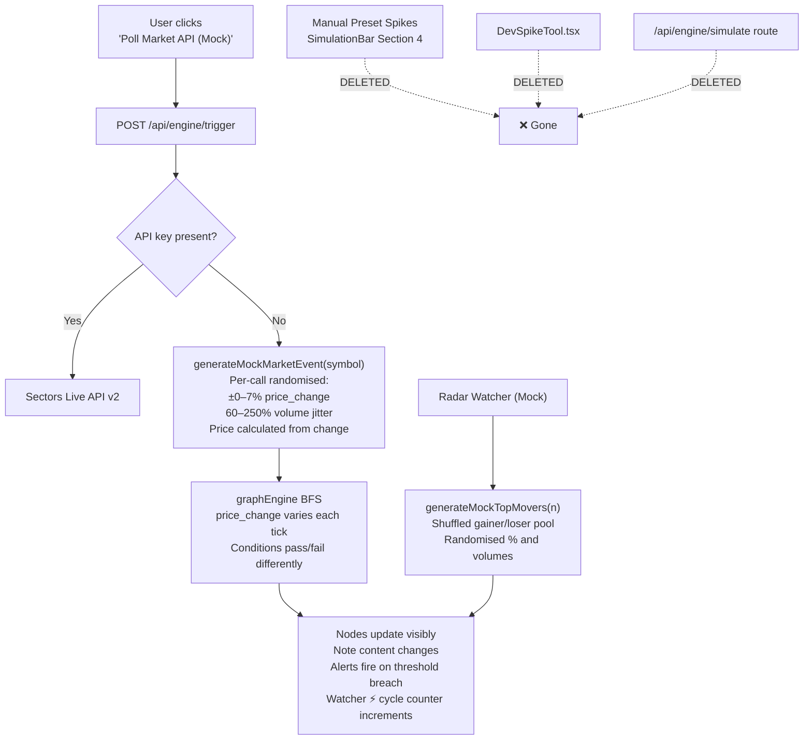

# Mock Poll Randomizer Fix & Full Preset Spike Deletion

## Goal

**"Poll Market API (Mock)"** currently returns the exact same static numbers every time — nodes never visibly react across repeated polls, making the live demo look broken. Fix this so every mock poll returns lightly randomised, realistic IDX market data that actually triggers node updates.

Simultaneously, **fully delete the Manual Preset Spike feature** — this includes the preset buttons, the DevSpikeTool modal, the `/api/engine/simulate` backend route, and all dead call sites.

---

## Diagnosis: Why Mock Poll Is Static

Looking at [`sectorsApi.ts` L101–L103](file:///home/abzolute/Projects/hackathon/src/server/services/sectorsApi.ts#L101-L103):

```ts
const jitter = (Math.random() - 0.5) * 0.4;   // ← only ±0.2% range!
const currentPriceChange = parseFloat(
  ((base.price_change || 0) + jitter).toFixed(2)
);
```

There IS a jitter — but it's **tiny** (±0.2%), and only applied to `price_change`. The base `price`, `prevPrice`, and `volume` are **always identical constants**. With conditions like `price_change > 5`, a jitter of ±0.2% on a base of `4.5` means it almost **never crosses the threshold** → nodes appear frozen.

Additionally, `MOCK_TOP_GAINERS` / `MOCK_TOP_LOSERS` in both [`mockData.ts`](file:///home/abzolute/Projects/hackathon/src/lib/mockData.ts) and [`sectorsApi.ts` L167–L281](file:///home/abzolute/Projects/hackathon/src/server/services/sectorsApi.ts#L167-L281) have **hardcoded timestamps** (`'16:30:00'`) and zero per-call variance.

---

## Proposed Changes

### Component 1: `src/server/services/sectorsApi.ts`

#### [MODIFY] sectorsApi.ts

**Step 1 — Replace `MOCK_MARKET_DATA` static table with base profiles + a `generateMockMarketEvent()` function:**

```ts
// Replace the static MOCK_MARKET_DATA constant with this:

const MOCK_BASE_PROFILES: Record<string, { price: number; avg_volume: number; rank: number }> = {
  BBCA: { price: 10450, avg_volume: 10_000_000, rank: 1 },
  BBRI: { price: 5200,  avg_volume: 18_000_000, rank: 2 },
  BMRI: { price: 6800,  avg_volume: 12_000_000, rank: 3 },
  TLKM: { price: 3100,  avg_volume:  9_500_000, rank: 4 },
  ASII: { price: 5050,  avg_volume:  5_800_000, rank: 5 },
  BBNI: { price: 5500,  avg_volume:  8_500_000, rank: 6 },
  UNTR: { price: 27100, avg_volume:  3_000_000, rank: 7 },
  ICBP: { price: 11800, avg_volume:  4_500_000, rank: 8 },
};

const MOCK_COMPANY_NAMES: Record<string, string> = {
  JECX: 'PT Nitrasanata Dharma Tbk',
  AGII: 'PT Samator Indo Gas Tbk',
  MPRO: 'PT Maha Properti Indonesia Tbk',
  BREN: 'PT Barito Renewables Tbk',
  CUAN: 'PT Petrindo Jaya Kreasi Tbk',
  BKSL: 'Sentul City Tbk',
  ELPI: 'PT Pelayaran Nasional Ekalya Tbk',
  EMAS: 'PT Merdeka Gold Resources Tbk',
  PSAB: 'J Resources Asia Pasifik Tbk',
  GOTO: 'PT GoTo Gojek Tokopedia Tbk',
  BBCA: 'PT Bank Central Asia Tbk.',
  TLKM: 'PT Telkom Indonesia Tbk.',
  ICBP: 'PT Indofood CBP Sukses Makmur Tbk.',
  BMRI: 'PT Bank Mandiri (Persero) Tbk.',
};

function rand(min: number, max: number): number {
  return min + Math.random() * (max - min);
}

function generateMockMarketEvent(symbol: string): MarketEvent {
  const base = MOCK_BASE_PROFILES[symbol] ?? { price: 5000, avg_volume: 5_000_000, rank: 10 };

  // Realistic IDX tick distribution:
  // 20% mild drop  (-5% to -1.5%)
  // 20% slight down (-1.5% to -0.3%)
  // 20% flat/drift  (-0.3% to +0.3%)
  // 20% slight up   (+0.3% to +2%)
  // 20% surge       (+2% to +7%)
  const roll = Math.random();
  let price_change: number;
  if      (roll < 0.20) price_change = rand(-5.0, -1.5);
  else if (roll < 0.40) price_change = rand(-1.5, -0.3);
  else if (roll < 0.60) price_change = rand(-0.3,  0.3);
  else if (roll < 0.80) price_change = rand( 0.3,  2.0);
  else                  price_change = rand( 2.0,  7.0);

  price_change = parseFloat(price_change.toFixed(2));

  const prevPrice = base.price;
  const price = Math.round(prevPrice * (1 + price_change / 100));
  const volumeMultiplier = rand(0.6, 2.5); // 60%–250% of avg
  const volume = Math.round(base.avg_volume * volumeMultiplier);

  return {
    symbol,
    price,
    prevPrice,
    price_change,
    volume,
    avg_volume: base.avg_volume,
    rank: base.rank,
    timestamp: new Date().toLocaleTimeString(),
  };
}
```

**Step 2 — Update `getMarketDataForSymbol()` mock fallback** to call `generateMockMarketEvent()`:

```ts
// Replace the old fallback block (lines ~91–118) with:

  // Mock fallback — fully randomised per call
  return {
    event: generateMockMarketEvent(upperSymbol),
    isLive: false,
  };
```

**Step 3 — Add `generateMockTopMovers()` for radar watcher polls:**

```ts
function generateMockTopMovers(n: number): { gainers: MarketEvent[]; losers: MarketEvent[] } {
  const gainerPool = ['JECX', 'AGII', 'MPRO', 'BREN', 'CUAN', 'BBCA', 'BMRI'];
  const loserPool  = ['BKSL', 'ELPI', 'EMAS', 'PSAB', 'GOTO', 'TLKM', 'ICBP'];

  const shuffle = (arr: string[]) => [...arr].sort(() => Math.random() - 0.5);

  const gainers = shuffle(gainerPool).slice(0, n).map((sym, i) => {
    const change = parseFloat(rand(1.5, 25.0).toFixed(2));
    const base = MOCK_BASE_PROFILES[sym] ?? { price: 2000, avg_volume: 10_000_000, rank: i + 1 };
    return {
      symbol: sym,
      name: MOCK_COMPANY_NAMES[sym] ?? sym,
      price: Math.round(base.price * (1 + change / 100)),
      prevPrice: base.price,
      price_change: change,
      volume: Math.round(base.avg_volume * rand(1.5, 4.0)),
      avg_volume: base.avg_volume,
      rank: i + 1,
      timestamp: new Date().toLocaleTimeString(),
    } satisfies MarketEvent;
  });

  const losers = shuffle(loserPool).slice(0, n).map((sym, i) => {
    const change = parseFloat((-rand(1.5, 25.0)).toFixed(2));
    const base = MOCK_BASE_PROFILES[sym] ?? { price: 500, avg_volume: 5_000_000, rank: i + 1 };
    return {
      symbol: sym,
      name: MOCK_COMPANY_NAMES[sym] ?? sym,
      price: Math.round(base.price * (1 + change / 100)),
      prevPrice: base.price,
      price_change: change,
      volume: Math.round(base.avg_volume * rand(1.2, 3.5)),
      avg_volume: base.avg_volume,
      rank: i + 1,
      timestamp: new Date().toLocaleTimeString(),
    } satisfies MarketEvent;
  });

  return { gainers, losers };
}
```

**Step 4 — Update `getTopMarketMovers()` mock fallback** to use `generateMockTopMovers()`:

```ts
// Replace the static fallback return at the bottom of getTopMarketMovers():

// Before:
return {
  gainers: MOCK_TOP_GAINERS.slice(0, targetStockCount),
  losers: MOCK_TOP_LOSERS.slice(0, targetStockCount),
  isLive: false,
};

// After:
const { gainers, losers } = generateMockTopMovers(targetStockCount);
return { gainers, losers, isLive: false };
```

> **Note:** The exported `MOCK_TOP_GAINERS` / `MOCK_TOP_LOSERS` constants are kept — `WatcherNode.tsx` imports them for zero-flicker initial display on node creation. Only the runtime poll path changes.

---

### Component 2: `src/lib/mockData.ts`

#### [MODIFY] mockData.ts

Update hardcoded `timestamp: '16:30:00'` entries to `new Date().toLocaleTimeString()` so the initial zero-flicker leaderboard display doesn't show a stale timestamp.

---

### Component 3: `src/app/api/engine/simulate/`

#### [DELETE] simulate/route.ts + directory

Delete `src/app/api/engine/simulate/route.ts` and remove the now-empty `simulate/` directory entirely. This endpoint is only ever called by the preset spike `runSimulation()` function, which is also being deleted. It becomes dead code.

---

### Component 4: `src/components/controls/DevSpikeTool.tsx`

#### [DELETE] DevSpikeTool.tsx

Delete the file entirely. It is only mounted inside `SimulationBar.tsx`. No other component imports it.

---

### Component 5: `src/components/controls/SimulationBar.tsx`

#### [MODIFY] SimulationBar.tsx

Remove everything related to preset spikes and the DevTool:

- **Delete** the `runSimulation()` function
- **Delete** `activePreset` state and `setActivePreset`
- **Delete** `isDevToolOpen` state and `setIsDevToolOpen`
- **Delete** props from interface: `onSimulateCustom`, `onSimulateSuccess`
- **Delete** the entire "Section 4: Manual Preset Spikes & DevTools" JSX block (the `<div>` containing the 4 preset buttons + DevTool button)
- **Delete** the `<DevSpikeTool ... />` rendered at the bottom of the component
- **Delete** the `import { DevSpikeTool }` line

Resulting clean `SimulationBarProps` interface:

```ts
interface SimulationBarProps {
  isOpen: boolean;
  onClose: () => void;
  autoTickActive?: boolean;
  onToggleAutoTick?: (active: boolean, intervalSec: number) => void;
  onExportScriffle?: () => void;
  onImportScriffle?: (file: File) => void;
  onLoadPreset?: (presetName: string) => void;
  apiKey?: string;
  onApiKeyChange?: (key: string) => void;
  onPollMarket?: () => Promise<void>;
}
```

---

### Component 6: `src/components/canvas/MarketCanvas.tsx` (and any other call sites)

#### [MODIFY] MarketCanvas.tsx

Remove the now-dead props passed to `<SimulationBar>`:
- `onSimulateSuccess` — was wired to SWR refresh; the SWR refresh can stay but needs to be triggered from `onPollMarket` or `autoTick` directly if it isn't already
- `onSimulateCustom` — remove entirely

Search for any other files that import `DevSpikeTool` or reference `runSimulation` / `/api/engine/simulate` and clean them up.

---

## Data Flow After Fix



---

## Verification Plan

### Automated Tests

```bash
bun test
```

All 111 tests must stay green. No new test files needed — the randomiser is a pure server-side helper with no exported unit-testable surface (existing `interpolateTemplate`, `leaderboard`, and `dslEngine` tests cover downstream correctness).

Also verify TypeScript compiles cleanly:
```bash
bun run build
```

### Manual Verification

1. **Start dev server:** `bun dev`
2. **Add a Watcher node** for `BBCA` with a Condition `price_change > 2` wired to a Note downstream.
3. **Click "Poll Market API (Mock)"** 6–8 times. Confirm:
   - `price_change` shown in Activity Feed changes every time
   - The Note content updates at least some of the time (condition passes sometimes, fails other times)
   - Watcher cycle counter (`⚡ N runs`) increments on every poll
4. **Add a Top Gainers Radar Watcher.** Poll mock 3–4 times. Confirm:
   - Leaderboard rankings shuffle (different tickers appear in top slots)
   - `%` change values differ per poll
5. **Open Demo Controls sidebar.** Confirm:
   - ✅ "Market Data Sync" / "Poll Market API (Mock)" button is present
   - ✅ "Auto-Polling Stream" Start/Stop is present
   - ❌ "Manual Preset Spikes" section is gone
   - ❌ No "Custom Spike (DevTool)" button
   - ❌ No "BBCA Surge / BBRI Volume Spike / JECX / BKSL" buttons
6. **Confirm no runtime errors** in browser console on poll.
