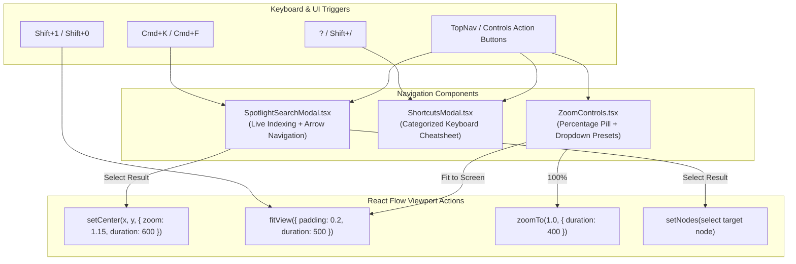

# Implementation Plan: Navigation & Productivity (Spotlight Search, Shortcuts Guide & Zoom Presets)

## 1. Overview
This plan details the design and architecture for the **Navigation & Productivity System** in Scriffle, inspired by Figma and FigJam. It equips presenters and researchers with instant spatial navigation across complex stock market research boards via:
1. **Spotlight Quick Search (`Cmd+K` / `Cmd+F`)**: Instant fuzzy search across all stock tickers, rule conditions, sticky note text, screener queries, and attached files with 1-click smooth camera pan & zoom.
2. **Keyboard Shortcuts Cheat Sheet Modal (`?` / `Shift+/`)**: A clean, categorized modal displaying all whiteboard shortcuts matching the flat outline design system.
3. **Zoom Level Badge & Fit-to-Screen (`Shift+1` / `Shift+0`)**: Interactive zoom percentage indicator with quick zoom presets and 1-key fit-to-screen.

---

## 2. Technical Architecture

---

## 3. Component Details & File Structure

### 3.1 `src/components/controls/SpotlightSearchModal.tsx`
* **Trigger:** `Cmd+K`, `Cmd+F`, `Ctrl+K`, `Ctrl+F`, or magnifying glass button in UI.
* **Search Corpus:**
  * **Watchers:** Ticker symbol (e.g. `BBCA`, `TLKM`), metric (`price_change`, `rank`), cycle count.
  * **AI Screeners:** Natural language prompt (e.g. `"top 5 banks by market cap"`).
  * **Sticky Notes:** Content text snippet & color.
  * **Free Text:** Text body snippet.
  * **Conditions:** Rule DSL expression (e.g. `price_change > 5 AND volume > 1000000`).
  * **Actions:** Action type (`fundamental_report`, `create_note`, `create_watcher`).
  * **Files:** Filename (e.g. `BBCA_Fundamental_Brief.html`), file size, format category.
  * **Stickers:** Sticker label (e.g. `Bullish`, `Breakout Ready`, `Top Pick`).
* **Interactions:**
  * Auto-focused search input with clean clear button.
  * `ArrowUp` / `ArrowDown` to navigate results list.
  * `Enter` to select and instantly jump camera to node location via `setCenter(x, y)` and mark node as selected.
  * `Escape` to close modal.
  * Empty state with helpful shortcut hints.

### 3.2 `src/components/controls/ShortcutsModal.tsx`
* **Trigger:** Pressing `?` (or `Shift+/`) anywhere on the canvas (when not editing an input/textarea) or Help button.
* **Categories:**
  * **Tools & Modes:** `V` (Move/Select), `H` (Hand/Pan tool), `T` (Drop Free-Text), `Space + Drag` (Temporary Pan).
  * **Card Actions:** `Delete` / `Backspace` (Delete selected), `Cmd+C` (Copy), `Cmd+V` (Paste at cursor), `Cmd+D` (Quick Duplicate), `Cmd+Z` (Undo), `Cmd+Shift+Z` / `Cmd+Y` (Redo).
  * **Grouping:** `Cmd+G` (Group selected), `Cmd+Shift+G` (Ungroup), `Double-Click` (Group Isolation Focus).
  * **Navigation:** `Cmd+K` / `Cmd+F` (Spotlight Search), `Shift+1` (Fit all nodes in screen), `Shift+0` (Zoom to 100%), `?` (Shortcuts Guide), `Esc` (Deselect / Exit Isolation).

### 3.3 Zoom Controls & Viewport Shortcuts
* **Viewport Integration:**
  * `Shift + 1`: Trigger `fitView({ duration: 500 })`.
  * `Shift + 0` or `Cmd + 0`: Reset zoom to `100%`.
  * Interactive zoom pill in canvas bottom or top bar showing real-time zoom level (e.g. `100%`) with quick preset dropdown (`50%`, `100%`, `150%`, `200%`, `Fit Screen`).

---

## 4. Design System Compliance
* **Typography:** `Stack Sans Text` — strictly Title Case / Sentence Case. Zero uppercase, zero spaced-out tracking.
* **Icons:** MingCute local font (`MingIcon name="mgc_..."`).
* **Borders & Shadows:** Flat 2px outline system (`border-2 border-slate-200 / border-slate-800`), zero box shadows.
* **Theme Tokens:** Full support for `light`, `mono`, and `dark` themes.

---

## 5. Implementation Steps & Milestones

1. **Step 1: Create `SpotlightSearchModal.tsx`**
   - Implement fuzzy matching across node types and configs.
   - Wire keyboard navigation (`ArrowUp`/`ArrowDown`/`Enter`/`Esc`).
   - Integrate with React Flow `setCenter` and node selection.

2. **Step 2: Create `ShortcutsModal.tsx`**
   - Build 4-column visual cheat sheet dialog with MingCute icons and keyboard key pills.
   - Connect global `?` key listener with input/textarea suppression guards.

3. **Step 3: Integrate Keyboard Shortcuts & Zoom Presets in `MarketCanvas.tsx` and `TopNav.tsx`**
   - Add `Cmd+K`, `Cmd+F`, `Shift+1`, `Shift+0`, and `?` keydown handlers.
   - Add Search and Shortcuts buttons to `TopNav.tsx` / `Controls`.
   - Add zoom percentage indicator with preset dropdown.

4. **Step 4: Unit Testing & Verification**
   - Add unit tests for search matching utility functions in `src/__tests__/unit/searchIndexer.test.ts`.
   - Run `bun test` to ensure all 83 existing tests stay green.

---

## 6. Verification Checklist
- [ ] Pressing `Cmd+K` or `Cmd+F` opens Spotlight Search.
- [ ] Typing ticker symbols (`BBCA`, `TLKM`) or keywords (`banks`, `breakout`, `report`) filters results in real-time.
- [ ] Pressing `Enter` closes the modal, flies the camera to the node, and highlights it.
- [ ] Pressing `?` opens the Shortcuts Cheat Sheet modal.
- [ ] Pressing `Shift+1` fits the entire canvas in view smoothly.
- [ ] Pressing `Shift+0` zooms the canvas to 100%.
- [ ] Typing `?` or `Cmd+F` inside a sticky note textarea edits text without opening modals.
- [ ] Theme switching (Light, Mono, Dark) works cleanly across all new modals.
- [ ] `bun test` passes with 100% green tests.
