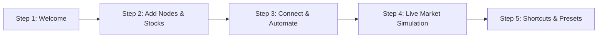

# 📋 Implementation Plan: Interactive Spotlight Onboarding Tour

> **Feature Type:** First-Time User Onboarding & Guided Interactive Spotlight Tour  
> **Target Delivery:** After Company Combobox implementation

---

## 1. Overview & Goal

The **Spotlight Onboarding Tour** guides new users through Scriffle's core mental models in **under 60 seconds**, highlighting live UI elements directly on the canvas without interrupting the native application feel.

### Key Objectives:
1. **First-Time Detection**: Automatically launches for new users on initial load via `localStorage.getItem('scriffle_onboarded_v1')`.
2. **Manual Re-triggering**: Accessible anytime via:
   - Top Help / Shortcuts modal (`?`)
   - Spotlight Search (`Ctrl+K` → *"Restart Onboarding Tour"*)
   - Presets drawer or Status Bar
3. **Institutional UI Design**: SVG cutout spotlight mask, 2px flat outline card popovers, zero drop shadows, MingCute icons, Stack Sans typography, and full Light/Mono/Dark/Custom theme support.
4. **Skippable & Resumable**: Users can exit at any step with `Esc` or the "Skip" button, leaving a subtle, minimizable *"Resume Tour (Step X/5)"* pill in the corner.

---

## 2. Tour Step Journey (The 5-Step "Aha!" Arc)



| Step # | Target UI Element (`data-tour`) | Title & Narrative | Primary Action / Highlight |
| :--- | :--- | :--- | :--- |
| **01** | *Screen Center / Welcome Modal* | **Welcome to Scriffle**<br>The visual whiteboard for IDX stock market research. | Introduces the FigJam × n8n concept. Shows *"Start Quick Tour (1 min)"* or *"Skip"*. |
| **02** | `[data-tour="nav-toolbar"]` *(Top Toolbar)* | **Add Nodes & Watchers**<br>Track single stocks, Top Gainers Radar, or AI Screeners. | Highlights the node creation toolbar and explains the zero-friction stock picker. |
| **03** | `[data-tour="quick-add-connector"]` *(Output Handle)* | **Wire Logic & Alerts**<br>Drag connections or click `+` handles to chain workflows. | Explains dual-branching Condition rules (`True` / `False`), Sticky Notes, and Discord Webhooks. |
| **04** | `[data-tour="simulation-bar"]` *(Simulation Bar)* | **Simulate Market Surge**<br>Watch the canvas auto-mutate in real time. | Highlights the "Do Once" and "Simulate Surge" buttons that evaluate rules without waiting for market hours. |
| **05** | `[data-tour="preset-drawer"]` & `[data-tour="spotlight-btn"]` | **Presets & Superpowers**<br>Jump fast with `Ctrl+K`, Themes, and pre-built templates. | Teaches `Space+Drag` to pan, `Ctrl+K` for instant jump, and the pre-built Presets library. |

---

## 3. Technical Architecture & File Structure

```
src/
├── context/
│   └── OnboardingContext.tsx        <-- Tour state store (step, active, dismissed, resume state)
├── components/
│   └── onboarding/
│       ├── SpotlightOverlay.tsx     <-- SVG cutout mask + backdrop transition layer
│       ├── TourCardPopover.tsx      <-- 2px border tooltip card positioned relative to target
│       ├── WelcomeTourModal.tsx     <-- Step 1 initial welcome intro card
│       ├── ResumeTourPill.tsx       <-- Minimizable bottom-right badge when dismissed early
│       └── tourStepsConfig.ts       <-- Step metadata, titles, descriptions, target element selectors
└── components/
    ├── controls/
    │   ├── TopNav.tsx               <-- Add data-tour attributes + Help (?) trigger
    │   ├── NavToolbar.tsx           <-- Add data-tour attributes
    │   ├── SimulationBar.tsx        <-- Add data-tour attributes
    │   └── SpotlightSearchModal.tsx <-- Add "Restart Tour" action
```

---

## 4. Detailed Component Design & State Management

### A. Tour State Store (`src/context/OnboardingContext.tsx`)

```typescript
export interface OnboardingState {
  isActive: boolean;
  currentStepIndex: number;
  hasCompleted: boolean;
  isMinimized: boolean;
  startTour: (fromStep?: number) => void;
  nextStep: () => void;
  prevStep: () => void;
  goToStep: (index: number) => void;
  skipTour: () => void;
  completeTour: () => void;
  toggleMinimizeResumePill: () => void;
}
```

#### Persistence Rules:
* `localStorage.getItem('scriffle_onboarded_v1')`: Set to `'true'` once completed or explicitly skipped.
* If user dismisses mid-tour (e.g. Step 3), store `scriffle_tour_step = 3` so the `ResumeTourPill` can resume right where they left off.

---

### B. Step Metadata Configuration (`src/components/onboarding/tourStepsConfig.ts`)

```typescript
export interface TourStep {
  id: string;
  title: string;
  description: string;
  targetSelector?: string; // CSS selector or data-tour attribute (undefined for modal steps)
  placement: 'center' | 'top' | 'bottom' | 'left' | 'right';
  badge: string;           // e.g. "Step 2 of 5"
  icon: string;            // MingCute icon name
}

export const TOUR_STEPS: TourStep[] = [
  {
    id: 'welcome',
    title: 'Welcome to Scriffle',
    description: 'An event-driven whiteboard built for Indonesian stock research. Build visual node pipelines that monitor market ticks and auto-mutate your canvas.',
    placement: 'center',
    badge: '1 of 5',
    icon: 'magic_line',
  },
  {
    id: 'toolbar',
    title: 'Node Library & Tickers',
    description: 'Add Watchers, AI Screeners, Conditions, Notes, and Discord Alerts. Use the new instant company search to pick from top IDX stocks with zero typing friction.',
    targetSelector: '[data-tour="nav-toolbar"]',
    placement: 'bottom',
    badge: '2 of 5',
    icon: 'layout_grid_line',
  },
  {
    id: 'connections',
    title: 'Auto-Wiring & Logic Rules',
    description: 'Drag from node output handles or click [+] to quickly branch your flow. Conditions support dual True (green) and False (rose) pathways.',
    targetSelector: '[data-tour="quick-add-connector"]',
    placement: 'left',
    badge: '3 of 5',
    icon: 'git_commit_line',
  },
  {
    id: 'simulation',
    title: 'Live Engine & Market Simulation',
    description: 'Test your whiteboard instantly. Click "Do Once" to execute all rules against live or simulated market spikes (e.g. BBCA +6.2%).',
    targetSelector: '[data-tour="simulation-bar"]',
    placement: 'top',
    badge: '4 of 5',
    icon: 'play_circle_line',
  },
  {
    id: 'superpowers',
    title: 'Keyboard Shortcuts & Presets',
    description: 'Press Ctrl+K anytime for Spotlight search, Space+Drag to pan smoothly, and explore the Presets library for pre-built research pipelines.',
    targetSelector: '[data-tour="presets-and-shortcuts"]',
    placement: 'bottom',
    badge: '5 of 5',
    icon: 'command_line',
  },
];
```

---

### C. Spotlight Overlay & Smooth Cutout Mask (`SpotlightOverlay.tsx`)

* Uses an SVG `<mask />` or full-screen canvas cutout with `mix-blend-mode` to create a smooth spotlight focus on the active target element.
* Surrounding backdrop: `bg-black/50 backdrop-blur-[2px] transition-all duration-300`.
* Target element gets a clean **2px Electric Blue pulsing outline ring** (`ring-2 ring-[#0050FF]`).
* Clicking outside the tooltip card or pressing `Esc` gracefully pauses the tour and shows the `ResumeTourPill`.

---

### D. Tour Card Popover (`TourCardPopover.tsx`)

* Positioned dynamically adjacent to the target element (with viewport collision clamping so it never renders offscreen).
* **Card Anatomy**:
  - **Header**: MingCute icon + Title + Step badge (`Step 2 of 5`) + Close (`×`) button.
  - **Body**: Clean description in Stack Sans Text.
  - **Footer**:
    - Left: *"Skip Tour"* text button.
    - Right: *"Back"* (secondary button) + *"Next →"* / *"Finish"* (Electric Blue solid button).
* **Keyboard Navigation**:
  - `→` or `Enter`: Next step.
  - `←`: Previous step.
  - `Escape`: Skip / minimize tour.

---

### E. Resume Tour Floating Pill (`ResumeTourPill.tsx`)

* When a tour is skipped or dismissed before finishing:
  ```text
  ┌──────────────────────────────────────────────┐
  │ 💡 Resume Scriffle Tour (Step 3/5)   [Resume] │
  └──────────────────────────────────────────────┘
  ```
* Fixed in bottom-right corner (`z-40`), sleek 2px flat outline, auto-fades after 5 minutes or on manual dismissal.

---

## 5. Theme & Design System Alignment

| Theme | Spotlight Card Styling | Action Button (`Next`) |
|---|---|---|
| **Light** | `bg-white border-2 border-slate-300 text-slate-900` | `bg-[#0050FF] text-white border-2 border-[#0050FF]` |
| **Mono** | `bg-[#FCFBF9] border-2 border-[#D8D4CA] text-[#242321]` | `bg-[#242321] text-[#FCFBF9] border-2 border-[#242321]` |
| **Dark** | `bg-[#14151B] border-2 border-[#282A36] text-[#E2E4E9]` | `bg-[#0050FF] text-white border-2 border-[#0050FF]` |
| **Custom** | `bg-[var(--custom-ui-bg)] border-2 border-[var(--custom-border-color)] text-[var(--custom-ui-text)]` | `bg-[var(--custom-accent-color)] text-white` |

> **Design Constraints**: Zero drop shadows, flat 2px borders, Stack Sans typography (Sentence Case only, no all-caps, no spaced letters).

---

## 6. Implementation Steps

1. **Step 1: State & Provider Setup**
   - Create `src/context/OnboardingContext.tsx` with localStorage sync and step state.
   - Wrap application root layout in `OnboardingProvider`.
2. **Step 2: Tour Step Definitions & DOM Target Tags**
   - Create `src/components/onboarding/tourStepsConfig.ts`.
   - Add `data-tour="..."` attributes to `NavToolbar.tsx`, `SimulationBar.tsx`, `TopNav.tsx`, and node connector handles.
3. **Step 3: Build Spotlight Mask & Card Popover**
   - Create `SpotlightOverlay.tsx` (SVG cutout mask with bounding rect calculations).
   - Create `TourCardPopover.tsx` (dynamic positioning, step progression, theme support).
   - Create `ResumeTourPill.tsx` (floating minimizable badge).
4. **Step 4: Re-trigger Integrations**
   - Add *"Restart Onboarding Tour"* item to `SpotlightSearchModal.tsx` (`Ctrl+K`).
   - Add *"Take Product Tour"* button inside Shortcuts/Help Modal (`?`).
5. **Step 5: Testing & Ergonomics Verification**
   - Test first-install auto-launch in clean private window.
   - Test step navigation forward/back and `Esc` skip behavior.
   - Verify viewport boundary protection on smaller screens.
   - Verify Light, Mono, Dark, and Custom theme styling.
