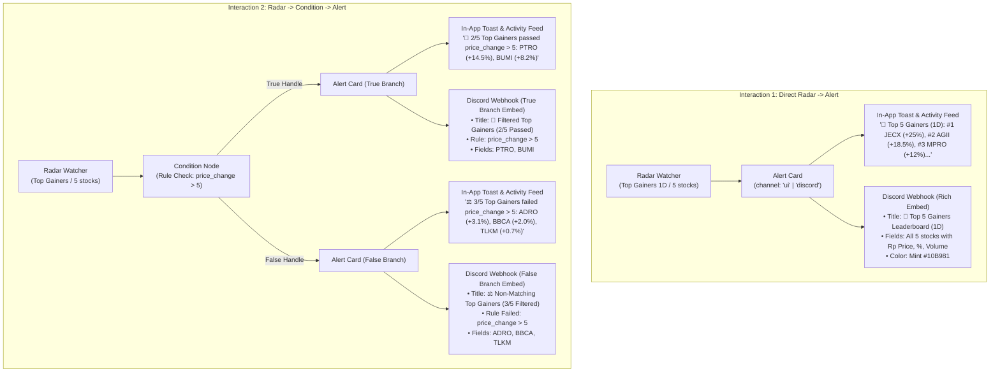

# 📋 Implementation Plan: Top Gainers/Losers Radar & Condition Alert Integrations (In-App & Discord)

> **Plan Name:** `RADAR_AND_CONDITION_ALERT_INTERACTIONS_PLAN.md`  
> **Target Subsystems:**
> - `src/server/services/discordWebhook.ts` (Rich Discord Embed Formatter for Multi-Mover & Filtered Lists)
> - `src/server/services/graphEngine.ts` (Radar Watcher Direct Alert & Condition $\rightarrow$ Alert Execution)
> - `src/__tests__/unit/discordWebhook.test.ts` & `src/__tests__/unit/conditionBranching.test.ts` (Unit Tests)  
> **Scope:** Complete end-to-end alert pipeline for multi-stock radar movers across In-App Toasts, Activity Feed Logs, and Discord Webhooks.

---

## 1. Executive Summary & Problem Breakdown

### 1.1 Current Limitations
Currently, when a **Top Gainers** or **Top Losers** Radar Watcher (or a Condition node downstream of it) connects to an **Alert Card**:
1. **Direct Connection (`Radar Watcher -> Alert`):**
   - **In-App Toast / Feed:** Truncates to a single stock (`Leaderboard Alert: Top 1 Gainer is JECX (+25%)`), completely omitting the remaining ranked movers (#2, #3, #4, #5).
   - **Discord Webhook:** Dispatches an embed with only `top1` data fields instead of a multi-asset leaderboard card.
2. **Conditional Branch (`Radar Watcher -> Condition -> Alert`):**
   - **In-App Toast / Feed:** Only formats `branchMovers[0]`, omitting the count and the rest of the companies that passed/failed the filter.
   - **Discord Webhook:** Sends a single-ticker alert for `#1` rather than a dedicated Filtered Multi-Stock Alert with passing/failing breakdown and the active rule definition.

---

## 2. Interaction Flows & Specifications



---

## 3. Technical Architecture & Message Formatting

### 3.1 Helper Functions in `graphEngine.ts`

#### A. Leaderboard Alert Summary Formatter (In-App & Activity Feed)
```typescript
export function generateLeaderboardAlertSummary(
  movers: MarketEvent[],
  mode?: string,
  period?: string
): string {
  if (!movers || movers.length === 0) {
    return '📊 Top Movers Alert: No active movers data';
  }
  const isGainer = mode === 'top_gainers' || mode === 'Top Gainers' || (movers[0] && movers[0].price_change >= 0);
  const icon = isGainer ? '🚀' : '🔻';
  const title = isGainer ? 'Top Gainers' : 'Top Losers';
  const periodStr = period ? ` (${period.toUpperCase()})` : '';
  const topList = movers
    .map((m, idx) => `#${m.rank || idx + 1} ${m.symbol} (${m.price_change >= 0 ? '+' : ''}${m.price_change}%)`)
    .join(', ');

  return `${icon} ${title}${periodStr}: ${topList}`;
}
```

#### B. Filtered Condition Alert Summary Formatter (In-App & Activity Feed)
```typescript
export function generateFilteredLeaderboardAlertSummary(
  movers: MarketEvent[],
  rule: string,
  mode?: string,
  totalEvaluated?: number,
  isPassedBranch: boolean = true
): string {
  const total = typeof totalEvaluated === 'number' ? totalEvaluated : movers.length;
  const count = movers.length;
  const isGainer = mode === 'top_gainers' || mode === 'Top Gainers' || (movers[0] && movers[0].price_change >= 0);
  const icon = isPassedBranch ? (isGainer ? '🚀' : '🔻') : '⚖️';
  const category = isGainer ? 'Top Gainers' : 'Top Losers';
  const branchWord = isPassedBranch ? 'passed' : 'failed';

  if (!movers || movers.length === 0) {
    return `📊 Filter Alert: 0/${total} ${category} ${branchWord} "${rule}"`;
  }

  const topList = movers
    .map((m, idx) => `#${m.rank || idx + 1} ${m.symbol} (${m.price_change >= 0 ? '+' : ''}${m.price_change}%)`)
    .join(', ');

  return `${icon} ${count}/${total} ${category} ${branchWord} "${rule}": ${topList}`;
}
```

---

### 3.2 Enhanced Multi-Stock Discord Webhook Dispatcher (`discordWebhook.ts`)

Add `sendDiscordLeaderboardAlert` supporting multi-asset ranked embeds:

```typescript
export interface SendDiscordLeaderboardAlertParams {
  webhookUrl: string;
  movers: MarketEvent[];
  mode?: string;
  period?: string;
  rule?: string;
  totalEvaluated?: number;
  isPassedBranch?: boolean;
  canvasName?: string;
  botName?: string;
  customMessage?: string;
}

export async function sendDiscordLeaderboardAlert({
  webhookUrl,
  movers,
  mode,
  period,
  rule,
  totalEvaluated,
  isPassedBranch = true,
  canvasName,
  botName = 'Scriffle Market Bot',
  customMessage,
}: SendDiscordLeaderboardAlertParams): Promise<{ success: boolean; statusCode: number; error?: string }>
```

#### Embed Payload Structure:
- **Title:**
  - *Direct:* `🚀 Top 5 IDX Gainers Leaderboard (1D)` / `🔻 Top 5 IDX Losers Leaderboard (1D)`
  - *Filtered (True):* `🚀 Filtered IDX Gainers (2/5 Passed)`
  - *Filtered (False):* `⚖️ Non-Matching IDX Gainers (3/5 Filtered)`
- **Color Theme:**
  - Gainers / Passed: Mint `#10B981` (`0x10b981`)
  - Losers: Coral `#FF5B79` (`0xff5b79`)
  - Filtered False Branch: Lavender / Charcoal (`0x8b5cf6` or `0x3b82f6`)
- **Description:**
  - Optional custom user note / prompt.
  - Active Rule badge: `**Filter Rule:** \`price_change > 5\`` (when routed through Condition).
- **Fields (up to 10 stocks):**
  - Field Name: `#1 PTRO (PT Petrosea Tbk)`
  - Field Value: `Rp 18,200 (+14.46%) • Vol: 55.0M`
  - Inline: `true` (3 columns per row on desktop Discord).
- **Canvas Board Field:** `📋 IDX Momentum Matrix`
- **Footer:** `Scriffle • Autonomous Financial Canvas for IDX` + ISO timestamp.

---

## 4. Execution Logic in `graphEngine.ts`

### 4.1 Flow 1: Direct Radar Watcher $\rightarrow$ Alert
In `executeGraphForRadarWatcher`:
1. Check `targetNode.type === 'alert'`.
2. Generate `alertMsg = generateLeaderboardAlertSummary(movers, watcherCfg.mode, watcherCfg.period)`.
3. If `targetCfg.channel === 'discord'` and `targetCfg.discordWebhookUrl`:
   - Call `sendDiscordLeaderboardAlert({ webhookUrl, movers, mode: watcherCfg.mode, period: watcherCfg.period, canvasName: canvas.name, botName: targetCfg.botName })`.
4. Update `AlertNode` state in SQLite:
   - `status: 'passed'`
   - `lastTriggeredAt: new Date().toLocaleTimeString()`
   - `lastWebhookStatus: webhookStatus`, `lastWebhookError: webhookError`
5. Create Execution Log in `prisma.log` for Activity Feed:
   - `eventSummary: webhookStatus === 'success' ? `[Discord] ${alertMsg}` : alertMsg`
   - `detailsJson: { movers, webhookStatus, webhookError }`

### 4.2 Flow 2: Radar Watcher $\rightarrow$ Condition $\rightarrow$ Alert
In `executeGraphForRadarWatcher` (inside `targetNode.type === 'condition'`):
1. For each `condEdge` connected to a downstream `childNode.type === 'alert'`:
2. Determine branch: `branchMovers = isTrueBranch ? passedMovers : failedMovers`.
3. Generate `alertMsg = generateFilteredLeaderboardAlertSummary(branchMovers, rule, watcherCfg.mode, movers.length, isTrueBranch)`.
4. If `childCfg.channel === 'discord'` and `childCfg.discordWebhookUrl`:
   - Call `sendDiscordLeaderboardAlert({ webhookUrl: childCfg.discordWebhookUrl, movers: branchMovers, mode: watcherCfg.mode, period: watcherCfg.period, rule, totalEvaluated: movers.length, isPassedBranch: isTrueBranch, canvasName: canvas.name, botName: childCfg.botName })`.
5. Update `AlertNode` state in SQLite.
6. Create Execution Log in `prisma.log` with formatted summary.

---

## 5. Detailed Step-by-Step Implementation Tasks

| Task # | File | Action | Details |
|---|---|---|---|
| **Task 1** | `src/server/services/discordWebhook.ts` | Implement `sendDiscordLeaderboardAlert` | Add multi-stock embed formatter with 3-column inline grid, rule badges, and dynamic sentiment colors. |
| **Task 2** | `src/server/services/graphEngine.ts` | Add Alert Summary Helpers | Implement `generateLeaderboardAlertSummary` and `generateFilteredLeaderboardAlertSummary`. |
| **Task 3** | `src/server/services/graphEngine.ts` | Update Direct Radar Alert Handler | Update `executeGraphForRadarWatcher` to dispatch multi-mover alert summaries to Activity Feed and Discord. |
| **Task 4** | `src/server/services/graphEngine.ts` | Update Condition $\rightarrow$ Alert Handler | Update condition edge loop in `executeGraphForRadarWatcher` to format filtered summaries for True and False branches. |
| **Task 5** | `src/server/services/graphEngine.ts` | Update AI Screener $\rightarrow$ Alert Handler | Support multi-company summary & rich embeds for direct Screener $\rightarrow$ Alert and Screener $\rightarrow$ Condition $\rightarrow$ Alert. |
| **Task 6** | `src/__tests__/unit/discordWebhook.test.ts` | Add Unit Tests | Add test suite verifying `sendDiscordLeaderboardAlert` payload construction, fields, colors, and error handling. |
| **Task 7** | `src/__tests__/unit/conditionBranching.test.ts` | Add Unit Tests | Add test suite verifying alert summary outputs for True/False branches and zero-match states. |

---

## 6. Verification & Acceptance Criteria

- [ ] **Direct Alert (In-App):** Connecting `Top Gainers` directly to an `Alert` node (UI channel) logs `#1` through `#5` tickers and percentages to Activity Feed.
- [ ] **Direct Alert (Discord):** Triggering `Top Gainers` connected to Discord Alert delivers a rich embed listing all 5 stocks with prices, changes, and volume in Discord.
- [ ] **Condition $\rightarrow$ Alert (True Branch In-App):** Connecting `Top Gainers -> Condition (price_change > 5) -> Alert` logs e.g. `🚀 2/5 Top Gainers passed price_change > 5: PTRO (+14.5%), BUMI (+8.2%)`.
- [ ] **Condition $\rightarrow$ Alert (False Branch In-App):** Connecting `Condition (False handle) -> Alert` logs failing stocks with count.
- [ ] **Condition $\rightarrow$ Alert (Discord):** Delivers rich embed displaying active filter rule and list of passing/failing stocks.
- [ ] **AI Screener Alerts:** Direct and conditional alerts from Screener nodes format all screened companies appropriately.
- [ ] **Test Green Mandate:** All unit tests pass with 100% green status.
