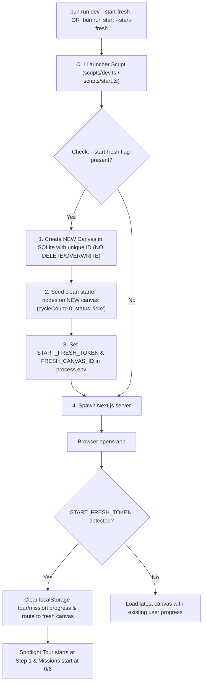

# 📋 Implementation Plan: Keyboard Shortcuts Modal Spacing & `--start-fresh` Non-Destructive New Project CLI Flag

> **Feature Type:** UI Polish & Developer / Presenter Tooling  
> **Status:** Revised Implementation Plan  
> **Objective:** 
> 1. Fix the cramped spacing in the Keyboard Shortcuts modal popup (`ShortcutsModal.tsx`), especially in the bottom footer area, ensuring all button text remains strictly single-line (`whitespace-nowrap`) with generous breathing room.
> 2. Add `--start-fresh` flag support to `bun run dev` and `bun run start` commands that **creates a new project board** (without overwriting or deleting existing projects) and resets the onboarding tour and mission detection counters to 0/6.

---

## 1. Problem Analysis & Root Cause

### A. Keyboard Shortcuts Modal Spacing (`ShortcutsModal.tsx`)
1. **Footer Horizontal Overcrowding**:
   - The footer currently attempts to pack four separate elements into a single `px-6 py-2.5` horizontal bar:
     1. Information caption: *"Works across all modern browsers and operating systems"* (~350px).
     2. Primary/secondary button: *"Product Tour"*.
     3. Primary action button: *"Hands-On Tutorial"*.
     4. Dismissal helper: *"Press Esc to close"*.
   - Inside `max-w-3xl` (768px), this results in severe horizontal compression where buttons bump against text, causing text wrapping or visual clutter.
2. **Cramped Item Rows & Container**:
   - The 2×2 category grid uses tight `gap-2` vertical spacing inside cards, making shortcut labels feel compressed.

### B. Onboarding Detection Counter Reset & `--start-fresh` CLI Flag
1. **Non-Destructive Project Creation (Never Overwrite Existing Canvases)**:
   - Previously, seeder operations completely wiped all existing canvases (`prisma.canvas.deleteMany()`).
   - `--start-fresh` must **NEVER overwrite or destroy existing projects**. It should create a fresh, dedicated project board in SQLite, leaving historical user canvases intact in the Project Switcher hub.
2. **Premature Mission 6 Completion on Pre-Seeded Canvases**:
   - In `prisma/seed.ts`, `bbcaWatcher` was seeded with `cycleCount: 8`.
   - In `missionValidator.ts`, Mission 6 is marked completed if `cycleCount > 0` or logs exist.
   - For a fresh project, the initial watcher nodes must start with `cycleCount: 0` and `status: 'idle'` so Mission 6 starts in pending status.
3. **Browser `localStorage` Reset for Fresh Sessions**:
   - When launching with `--start-fresh`, the frontend needs to reset onboarding suppression and mission progress so the presenter gets a pure first-time user experience on the new project.

---

## 2. Proposed Solutions

### Part 1: Keyboard Shortcuts Modal Spacing Refactor (`ShortcutsModal.tsx`)

1. **Expanded Dimensions & Comfortable Grid Layout**:
   - Increase modal max width to `max-w-4xl` (`896px`) for institutional breathing room.
   - Upgrade category cards to `p-5` with `gap-3.5` between shortcut rows.
   - Enhance kbd badges with crisp contrast, clean padding (`px-2 py-0.5`), and consistent typography.

2. **De-Cluttered & Spacious Footer Architecture**:
   - Separate the actions cleanly:
     - **Left Side**: Clean 1-liner buttons with `whitespace-nowrap shrink-0`:
       - `[✨ Product Tour]` (Secondary pill, `px-3.5 py-1.5`, strictly 1 line)
       - `[🎯 Hands-On Tutorial]` (Primary electric blue pill, `px-3.5 py-1.5`, strictly 1 line)
     - **Right Side**: Clean `Esc` badge pill (`Press Esc to close`) + browser compatibility indicator.
   - Ensure zero text wrapping (`whitespace-nowrap`) across all screen widths.

```
┌────────────────────────────────────────────────────────────────────────┐
│ ⌨️ Keyboard Shortcuts                                               ✕ │
├────────────────────────────────────────────────────────────────────────┤
│ [ Tools & Modes ]                  [ Card Actions ]                    │
│   V       Move & Select Tool         Del ⌫   Delete Selected Cards     │
│   H       Hand & Pan Tool            Ctrl C  Copy Selected Elements    │
│   T       Drop Free-Text at Cursor   Ctrl V  Paste at Cursor           │
│   Space   Temporary Hand Pan         Ctrl Z  Undo Mutation             │
│                                                                        │
│ [ Grouping & Focus ]               [ Navigation & View ]               │
│   Ctrl G  Group Selected Cards       Ctrl K  Spotlight Quick Search    │
│   2×Click Group Isolation Mode       Tab     Jump to Closest Card      │
│   ⇧ Drag  Marquee Box Select         ⇧ 1     Fit All to Screen         │
├────────────────────────────────────────────────────────────────────────┤
│ [✨ Product Tour]  [🎯 Hands-On Tutorial]           Press [Esc] to close │
└────────────────────────────────────────────────────────────────────────┘
```

---

### Part 2: `--start-fresh` Non-Destructive New Project CLI Flag



#### Detailed Technical Specifications:

1. **Non-Destructive Project Creation Helper (`src/lib/freshProjectCreator.ts`)**:
   - When called:
     - Generates a new unique canvas ID (UUID).
     - Inserts a new `Canvas` record: `name: "Fresh Demo Project (${timestamp})"`.
     - Populates starter nodes on this new canvas with `cycleCount: 0` and empty logs.
     - **Preserves all existing canvas records** in SQLite.
     - Returns the new `canvasId`.

2. **CLI Runner Scripts (`scripts/dev.ts` & `scripts/start.ts`)**:
   - Inspects `process.argv` for `--start-fresh`.
   - When `--start-fresh` is passed:
     1. Runs `freshProjectCreator.ts` to insert the new project into SQLite.
     2. Sets `NEXT_PUBLIC_START_FRESH_TOKEN=<timestamp>`.
     3. Sets `NEXT_PUBLIC_START_FRESH_CANVAS_ID=<newCanvasId>`.
     4. Logs friendly confirmation:
        ```text
        ✨ [Scriffle] Starting in Fresh Mode:
           - Created new project: "Fresh Demo Project" (ID: <newCanvasId>)
           - Existing projects preserved in SQLite history
           - Reset onboarding tour & sandbox tutorial detection counters to 0/6
        ```
   - Spawns `next dev` (with Turbopack) or `next start` passing through all other arguments.

3. **Frontend Sync (`src/app/page.tsx`, `OnboardingContext.tsx`, `SandboxTutorialContext.tsx`)**:
   - On initial mount, if `NEXT_PUBLIC_START_FRESH_TOKEN` is present and newer than `localStorage.getItem('scriffle_last_fresh_token')`:
     - Sets `localStorage.setItem('scriffle_last_fresh_token', token)`.
     - Clears tour suppression and mission progress from `localStorage`.
     - Automatically switches/redirects to the newly created fresh project board.
     - Auto-triggers Step 1 of the Spotlight Tour.

4. **Package Scripts Update (`package.json`)**:
   ```json
   {
     "scripts": {
       "dev": "bun ./scripts/dev.ts",
       "build": "next build",
       "start": "bun ./scripts/start.ts"
     }
   }
   ```

---

## 3. Step-by-Step Implementation Tasks

| # | File | Action | Details |
|---|---|---|---|
| **1** | `src/components/controls/ShortcutsModal.tsx` | Modify | Expand to `max-w-4xl`, increase footer padding to `py-4 px-6`, enforce `whitespace-nowrap` on buttons, cleanly space out action pills from `Esc` badge. |
| **2** | `src/lib/freshProjectCreator.ts` | Create | Non-destructive project creator that creates a new canvas and seeds clean starter nodes with `cycleCount: 0` without wiping SQLite. |
| **3** | `scripts/dev.ts` | Create | Runner for `next dev` that intercepts `--start-fresh`, calls `freshProjectCreator`, sets fresh tokens, and spawns `next dev`. |
| **4** | `scripts/start.ts` | Create | Runner for `next start` that intercepts `--start-fresh`, calls `freshProjectCreator`, sets fresh tokens, and spawns `next start`. |
| **5** | `package.json` | Modify | Point `"dev"` and `"start"` to `scripts/dev.ts` and `scripts/start.ts`. |
| **6** | `src/context/OnboardingContext.tsx` & `src/app/page.tsx` | Modify | Check fresh token on mount to clear localStorage and load the newly created canvas. |
| **7** | `src/__tests__/unit/startFresh.test.ts` | Create | Unit test suite verifying non-destructive canvas creation, token detection, storage reset, and zero-count initial state. |

---

## 4. Verification & Validation Plan

1. **Shortcuts Modal Visual Check**:
   - Open Shortcuts Modal (`?` or Help button).
   - Verify category cards have comfortable padding.
   - Verify footer buttons (`Product Tour`, `Hands-On Tutorial`) are strictly single-line (`whitespace-nowrap`), never wrapping, with generous separation from the `Esc` badge.
2. **Non-Destructive `--start-fresh` Verification**:
   - Have an existing board with custom cards.
   - Run `bun run dev --start-fresh`:
     - Verify a NEW canvas is created with `cycleCount: 0`.
     - Verify previous canvases are still visible in the Project Switcher modal (`ProjectSwitcherModal`).
     - Verify Spotlight Tour starts at Step 1 and Tutorial Missions start at 0/6 pending.
   - Complete 2 missions $\rightarrow$ stop server $\rightarrow$ run `bun run dev --start-fresh` $\rightarrow$ verify another new fresh project is created with 0/6 missions, while previous boards remain intact.
3. **Automated Unit Tests**:
   - Run `bun test` to ensure all 21+ test suites pass with 100% green status.
