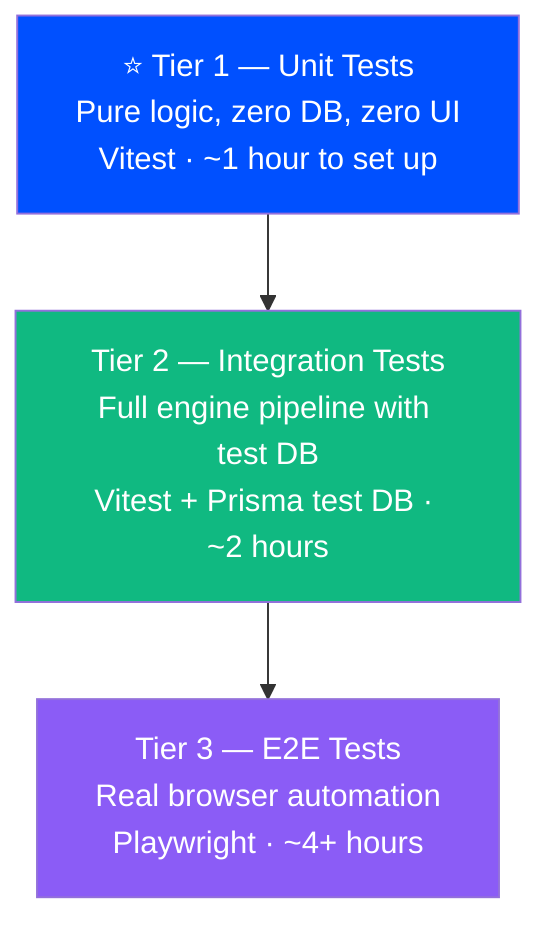

# 🧪 Scriffle Testing Implementation Plan

> A pragmatic, zero-overhead testing scheme for a hackathon-scale codebase. No QA experience needed.

> [!IMPORTANT]
> **THE TESTING MANDATE — NON-NEGOTIABLE FOR ALL AGENTS:**
> Adding any new feature means adding new test cases covering every possible input, edge case, and node connection scenario. This applies to every PR, every session, every agent. Run `bun test` before marking any task complete. All 83 existing tests must stay green.

> [!NOTE]
> **Current Status (as of last session):** Tier 1 is fully implemented — 83 tests, 0 failures, ~120ms.
> Tier 2 (integration tests with isolated test.db) and Tier 3 (Playwright E2E) are planned — see implementation checklist at the bottom.

---

## Overview

The strategy has **3 tiers**, implemented incrementally. You don't need to do all 3 at once — Tier 1 alone covers the majority of your manual click-testing pain.



> [!IMPORTANT]
> **Start with Tier 1.** It covers ~80% of what you're manually testing in the UI and takes about an hour to set up.

---

## Tier 1 — Unit Tests (Pure Logic)

### What gets tested

These are all **pure functions** — no database, no network, no React. They take inputs and return outputs. Perfect for unit tests.

| File | Function | What to test |
|---|---|---|
| [`dslEngine.ts`](file:///home/abzolute/Projects/hackathon/src/server/services/dslEngine.ts) | `evaluateCondition()` | All DSL rule combinations |
| [`graphEngine.ts`](file:///home/abzolute/Projects/hackathon/src/server/services/graphEngine.ts) | `interpolateTemplate()` | Template variable substitution |
| [`graphEngine.ts`](file:///home/abzolute/Projects/hackathon/src/server/services/graphEngine.ts) | `generateLeaderboardNoteContent()` | Leaderboard formatting |
| [`graphEngine.ts`](file:///home/abzolute/Projects/hackathon/src/server/services/graphEngine.ts) | `generateScreenerNoteContent()` | Screener output formatting |

### Tooling

**Vitest** — works natively with TypeScript + Bun, Jest-compatible syntax, zero config pain.

```bash
bun add -d vitest @vitest/coverage-v8
```

Add to `package.json`:

```json
"scripts": {
  "test": "vitest run",
  "test:watch": "vitest",
  "test:coverage": "vitest run --coverage"
}
```

Add `vitest.config.ts` to project root:

```typescript
import { defineConfig } from 'vitest/config';
import path from 'path';

export default defineConfig({
  test: {
    globals: true,
    environment: 'node',
  },
  resolve: {
    alias: {
      '@': path.resolve(__dirname, './src'),
    },
  },
});
```

### File Structure

```
src/
└── __tests__/
    ├── fixtures/
    │   └── marketEvents.ts          ← Shared mock MarketEvents (BBCA, BBRI, top movers)
    └── unit/
        ├── dslEngine.test.ts
        ├── interpolateTemplate.test.ts
        ├── leaderboard.test.ts
        └── screenerNote.test.ts
```

### Test Cases: `dslEngine.test.ts`

This covers every operator your Condition nodes use.

```typescript
// src/__tests__/unit/dslEngine.test.ts
import { describe, it, expect } from 'vitest';
import { evaluateCondition } from '@/server/services/dslEngine';
import { BBCA_SURGE, TLKM_DROP, BBRI_NEUTRAL } from '../fixtures/marketEvents';

describe('evaluateCondition — price_change rules', () => {
  it('returns true when price_change > 5 and event is +6.37%', () => {
    expect(evaluateCondition('price_change > 5', BBCA_SURGE)).toBe(true);
  });

  it('returns false when price_change > 5 and event is +1.96%', () => {
    expect(evaluateCondition('price_change > 5', BBRI_NEUTRAL)).toBe(false);
  });

  it('returns true for drop: price_change < 0', () => {
    expect(evaluateCondition('price_change < 0', TLKM_DROP)).toBe(true);
  });

  it('returns false for drop on a gainer', () => {
    expect(evaluateCondition('price_change < 0', BBCA_SURGE)).toBe(false);
  });
});

describe('evaluateCondition — volume rules', () => {
  it('returns true when volume > 2 * avg_volume for a volume spike', () => {
    expect(evaluateCondition('volume > 2 * avg_volume', BBCA_SURGE)).toBe(true);
  });

  it('returns false when volume is below threshold', () => {
    expect(evaluateCondition('volume > 2 * avg_volume', BBRI_NEUTRAL)).toBe(false);
  });
});

describe('evaluateCondition — compound AND/OR rules', () => {
  it('handles AND: both conditions true', () => {
    expect(evaluateCondition('price_change > 5 AND volume > 1000000', BBCA_SURGE)).toBe(true);
  });

  it('handles AND: first true, second false → overall false', () => {
    expect(evaluateCondition('price_change > 5 AND volume > 999999999', BBCA_SURGE)).toBe(false);
  });

  it('handles OR: at least one condition true', () => {
    expect(evaluateCondition('price_change > 10 OR volume > 1000000', BBCA_SURGE)).toBe(true);
  });

  it('is case-insensitive for AND/OR', () => {
    expect(evaluateCondition('price_change > 5 and volume > 1000000', BBCA_SURGE)).toBe(true);
  });
});

describe('evaluateCondition — edge cases', () => {
  it('returns false for empty rule string', () => {
    expect(evaluateCondition('', BBCA_SURGE)).toBe(false);
  });

  it('returns false for malformed DSL (no crash)', () => {
    expect(evaluateCondition('price_change >>> broken &&', BBCA_SURGE)).toBe(false);
  });

  it('returns false for rank-based rule when rank is not set', () => {
    // rank defaults to 0 in evaluateCondition context
    expect(evaluateCondition('rank <= 3', { ...BBCA_SURGE, rank: undefined })).toBe(false);
  });

  it('handles rank correctly', () => {
    expect(evaluateCondition('rank <= 3', { ...BBCA_SURGE, rank: 1 })).toBe(true);
  });
});
```

### Test Cases: `interpolateTemplate.test.ts`

> [!NOTE]
> `interpolateTemplate` is a private function in `graphEngine.ts`. We'll need to **export it** first (just add `export` keyword). One-line change.

```typescript
// src/__tests__/unit/interpolateTemplate.test.ts
import { describe, it, expect } from 'vitest';
import { interpolateTemplate } from '@/server/services/graphEngine';
import { BBCA_SURGE, TLKM_DROP } from '../fixtures/marketEvents';

describe('interpolateTemplate — variable substitution', () => {
  it('substitutes ${symbol}', () => {
    const result = interpolateTemplate('Stock: ${symbol}', BBCA_SURGE);
    expect(result).toContain('BBCA');
  });

  it('substitutes ${price_change} with formatted +/- sign', () => {
    const result = interpolateTemplate('Change: ${price_change}', BBCA_SURGE);
    expect(result).toContain('+6.37%');
  });

  it('shows minus sign for losers', () => {
    const result = interpolateTemplate('Change: ${price_change}', TLKM_DROP);
    expect(result).toMatch(/-/);
  });

  it('substitutes ${volume} in human-readable format', () => {
    const result = interpolateTemplate('Volume: ${volume}', BBCA_SURGE);
    // 25,000,000 → "25.0M"
    expect(result).toContain('25.0M');
  });

  it('substitutes ${price} as IDR formatted', () => {
    const result = interpolateTemplate('Price: ${price}', BBCA_SURGE);
    expect(result).toContain('Rp');
    expect(result).toContain('10.850');
  });

  it('leaves unknown variables unchanged', () => {
    const result = interpolateTemplate('Hello ${unknown_var}', BBCA_SURGE);
    expect(result).toBe('Hello ${unknown_var}');
  });

  it('handles complex multi-variable template', () => {
    const template = '${symbol} surged ${price_change} on ${volume} volume at ${timestamp}';
    const result = interpolateTemplate(template, BBCA_SURGE);
    expect(result).toContain('BBCA');
    expect(result).toContain('+6.37%');
    expect(result).toContain('25.0M');
  });
});
```

### Test Cases: `leaderboard.test.ts`

```typescript
// src/__tests__/unit/leaderboard.test.ts
import { describe, it, expect } from 'vitest';
import { generateLeaderboardNoteContent } from '@/server/services/graphEngine';
import { MOCK_GAINERS, MOCK_LOSERS } from '../fixtures/marketEvents';

describe('generateLeaderboardNoteContent — gainers', () => {
  it('produces a non-empty string', () => {
    const result = generateLeaderboardNoteContent(MOCK_GAINERS, 'top_gainers');
    expect(result.length).toBeGreaterThan(0);
  });

  it('contains 🚀 emoji for gainers', () => {
    const result = generateLeaderboardNoteContent(MOCK_GAINERS, 'top_gainers');
    expect(result).toContain('🚀');
  });

  it('contains expected symbols from mock list', () => {
    const result = generateLeaderboardNoteContent(MOCK_GAINERS, 'top_gainers');
    expect(result).toContain('JECX');
    expect(result).toContain('AGII');
  });

  it('contains rank indicators like #1, #2', () => {
    const result = generateLeaderboardNoteContent(MOCK_GAINERS, 'top_gainers');
    expect(result).toMatch(/#1/);
    expect(result).toMatch(/#2/);
  });
});

describe('generateLeaderboardNoteContent — losers', () => {
  it('contains 🔻 emoji for losers', () => {
    const result = generateLeaderboardNoteContent(MOCK_LOSERS, 'top_losers');
    expect(result).toContain('🔻');
  });
});

describe('generateLeaderboardNoteContent — empty input', () => {
  it('returns a fallback message for empty movers list', () => {
    const result = generateLeaderboardNoteContent([]);
    expect(result).toContain('No movers data available');
  });
});
```

### Shared Fixtures

```typescript
// src/__tests__/fixtures/marketEvents.ts
import type { MarketEvent } from '@/types/canvas';

export const BBCA_SURGE: MarketEvent = {
  symbol: 'BBCA',
  price: 10850,
  prevPrice: 10200,
  price_change: 6.37,
  volume: 25_000_000,
  avg_volume: 10_000_000,
  rank: 1,
  timestamp: '16:30:00',
};

export const BBRI_NEUTRAL: MarketEvent = {
  symbol: 'BBRI',
  price: 5200,
  prevPrice: 5100,
  price_change: 1.96,
  volume: 18_000_000,
  avg_volume: 18_000_000,
  rank: 2,
  timestamp: '16:30:00',
};

export const TLKM_DROP: MarketEvent = {
  symbol: 'TLKM',
  price: 3100,
  prevPrice: 3150,
  price_change: -1.58,
  volume: 8_500_000,
  avg_volume: 9_500_000,
  rank: 4,
  timestamp: '16:30:00',
};

export const MOCK_GAINERS: MarketEvent[] = [
  { symbol: 'JECX', name: 'PT Nitrasanata Dharma Tbk', price: 1950, prevPrice: 1560, price_change: 25.0, volume: 38_500_000, avg_volume: 12_000_000, rank: 1, timestamp: '16:30:00' },
  { symbol: 'AGII', name: 'PT Samator Indo Gas Tbk', price: 3080, prevPrice: 2500, price_change: 23.2, volume: 48_000_000, avg_volume: 20_000_000, rank: 2, timestamp: '16:30:00' },
  { symbol: 'MPRO', name: 'PT Maha Properti Indonesia Tbk', price: 9800, prevPrice: 8000, price_change: 22.5, volume: 29_000_000, avg_volume: 15_000_000, rank: 3, timestamp: '16:30:00' },
];

export const MOCK_LOSERS: MarketEvent[] = [
  { symbol: 'BKSL', name: 'Sentul City Tbk', price: 61, prevPrice: 67, price_change: -8.96, volume: 310_000_000, avg_volume: 180_000_000, rank: 1, timestamp: '16:30:00' },
  { symbol: 'ELPI', name: 'PT Pelayaran Nasional Ekalya Tbk', price: 1040, prevPrice: 1245, price_change: -16.47, volume: 45_000_000, avg_volume: 22_000_000, rank: 2, timestamp: '16:30:00' },
];
```

---

## Tier 2 — Integration Tests (Engine Pipeline)

### What gets tested

The full BFS graph traversal from `graphEngine.ts`, running against a **real but isolated SQLite test database** — not your `dev.db`.

| Scenario | What it verifies |
|---|---|
| Watcher → Condition (pass) → Note | Note content gets updated in DB |
| Watcher → Condition (fail) → Note | Note is **not** updated |
| Action `create_note` | New Note node is spawned in DB |
| Action `create_watcher` + auto-pipeline | 3 new nodes (Watcher + Condition + Note) appear |
| Duplicate watcher guard | Second `create_watcher` for same symbol is skipped |
| Leaderboard Radar Watcher | Note gets full ranked table |

### Tooling

No new libraries needed — just Vitest + Prisma pointed at a test DB file.

```bash
# .env.test (create this file)
DATABASE_URL="file:./prisma/test.db"
```

```typescript
// vitest.config.ts — update to load .env.test for integration tests
import { defineConfig } from 'vitest/config';
import path from 'path';

export default defineConfig({
  test: {
    globals: true,
    environment: 'node',
    env: { DATABASE_URL: 'file:./prisma/test.db' }, // isolation
  },
  resolve: {
    alias: { '@': path.resolve(__dirname, './src') },
  },
});
```

### Test setup helpers

```typescript
// src/__tests__/integration/helpers/setupTestDb.ts
import { prisma } from '@/lib/prisma';

export async function createTestCanvas(name = 'Test Canvas') {
  return prisma.canvas.create({ data: { name } });
}

export async function createNode(canvasId: string, type: string, config: object, position = { x: 100, y: 100 }) {
  return prisma.node.create({
    data: {
      canvasId,
      type,
      positionX: position.x,
      positionY: position.y,
      configJson: JSON.stringify(config),
      stateJson: JSON.stringify({ status: 'idle' }),
    },
  });
}

export async function createEdge(canvasId: string, fromId: string, toId: string) {
  return prisma.edge.create({ data: { canvasId, fromId, toId } });
}

export async function teardownCanvas(canvasId: string) {
  await prisma.log.deleteMany({ where: { canvasId } });
  await prisma.edge.deleteMany({ where: { canvasId } });
  await prisma.node.deleteMany({ where: { canvasId } });
  await prisma.canvas.delete({ where: { id: canvasId } });
}
```

### Integration Test: Engine BFS

```typescript
// src/__tests__/integration/graphEngine.test.ts
import { describe, it, expect, beforeEach, afterEach } from 'vitest';
import { executeGraphForEvent } from '@/server/services/graphEngine';
import { prisma } from '@/lib/prisma';
import { createTestCanvas, createNode, createEdge, teardownCanvas } from './helpers/setupTestDb';
import { BBCA_SURGE } from '../fixtures/marketEvents';

describe('executeGraphForEvent — Watcher → Condition → Note pipeline', () => {
  let canvasId: string;

  beforeEach(async () => {
    const canvas = await createTestCanvas('Test Pipeline');
    canvasId = canvas.id;
  });

  afterEach(async () => {
    await teardownCanvas(canvasId);
  });

  it('updates note content when condition passes', async () => {
    // Arrange
    const watcher = await createNode(canvasId, 'watcher', { symbol: 'BBCA', metric: 'price_change', interval: 5 });
    const condition = await createNode(canvasId, 'condition', { rule: 'price_change > 5' });
    const note = await createNode(canvasId, 'note', { content: 'Initial content', color: 'yellow' });

    await createEdge(canvasId, watcher.id, condition.id);
    await createEdge(canvasId, condition.id, note.id);

    // Act
    const result = await executeGraphForEvent(canvasId, BBCA_SURGE);

    // Assert
    expect(result.triggeredNodes).toContain(watcher.id);
    expect(result.triggeredNodes).toContain(condition.id);
    expect(result.triggeredNodes).toContain(note.id);

    const updatedNote = await prisma.node.findUnique({ where: { id: note.id } });
    const updatedConfig = JSON.parse(updatedNote!.configJson);
    expect(updatedConfig.content).not.toBe('Initial content');
    expect(updatedConfig.content).toContain('BBCA');
  });

  it('does NOT update note when condition fails', async () => {
    // Arrange — high threshold that BBCA_SURGE (+6.37%) won't pass
    const watcher = await createNode(canvasId, 'watcher', { symbol: 'BBCA', metric: 'price_change', interval: 5 });
    const condition = await createNode(canvasId, 'condition', { rule: 'price_change > 10' });
    const note = await createNode(canvasId, 'note', { content: 'Should stay unchanged', color: 'yellow' });

    await createEdge(canvasId, watcher.id, condition.id);
    await createEdge(canvasId, condition.id, note.id);

    // Act
    const result = await executeGraphForEvent(canvasId, BBCA_SURGE);

    // Assert
    expect(result.triggeredNodes).not.toContain(note.id);
    const updatedNote = await prisma.node.findUnique({ where: { id: note.id } });
    const config = JSON.parse(updatedNote!.configJson);
    expect(config.content).toBe('Should stay unchanged');
  });

  it('increments watcher cycle counter on each trigger', async () => {
    const watcher = await createNode(canvasId, 'watcher', { symbol: 'BBCA', metric: 'price_change', interval: 5 });

    await executeGraphForEvent(canvasId, BBCA_SURGE);
    await executeGraphForEvent(canvasId, BBCA_SURGE);

    const updatedWatcher = await prisma.node.findUnique({ where: { id: watcher.id } });
    const state = JSON.parse(updatedWatcher!.stateJson!);
    expect(state.cycleCount).toBe(2);
  });
});

describe('executeGraphForEvent — Action: create_note', () => {
  let canvasId: string;

  beforeEach(async () => {
    const canvas = await createTestCanvas('Action Test');
    canvasId = canvas.id;
  });
  afterEach(async () => { await teardownCanvas(canvasId); });

  it('spawns a new note node on canvas', async () => {
    const watcher = await createNode(canvasId, 'watcher', { symbol: 'BBCA', metric: 'price_change', interval: 5 });
    const action = await createNode(canvasId, 'action', { action: 'create_note' });
    await createEdge(canvasId, watcher.id, action.id);

    const before = await prisma.node.count({ where: { canvasId } });
    await executeGraphForEvent(canvasId, BBCA_SURGE);
    const after = await prisma.node.count({ where: { canvasId } });

    expect(after).toBe(before + 1); // 1 new note spawned
  });
});

describe('executeGraphForEvent — Action: create_watcher', () => {
  let canvasId: string;

  beforeEach(async () => {
    const canvas = await createTestCanvas('Watcher Spawn Test');
    canvasId = canvas.id;
  });
  afterEach(async () => { await teardownCanvas(canvasId); });

  it('spawns a complete 3-node pipeline (Watcher + Condition + Note)', async () => {
    const watcher = await createNode(canvasId, 'watcher', { symbol: 'BBCA', metric: 'price_change', interval: 5 });
    const action = await createNode(canvasId, 'action', { action: 'create_watcher' });
    await createEdge(canvasId, watcher.id, action.id);

    const before = await prisma.node.count({ where: { canvasId } });
    const result = await executeGraphForEvent(canvasId, { ...BBCA_SURGE, symbol: 'BBRI' }); // new symbol

    const after = await prisma.node.count({ where: { canvasId } });
    expect(after).toBe(before + 3); // Watcher + Condition + Note
    expect(result.mutationsCount).toBe(3);
  });

  it('skips spawning duplicate watcher for same symbol', async () => {
    // Pre-create a BBCA watcher already on canvas
    await createNode(canvasId, 'watcher', { symbol: 'BBCA', metric: 'price_change', interval: 5 });
    const triggerWatcher = await createNode(canvasId, 'watcher', { symbol: 'BBRI', metric: 'price_change', interval: 5 });
    const action = await createNode(canvasId, 'action', { action: 'create_watcher' });
    await createEdge(canvasId, triggerWatcher.id, action.id);

    const before = await prisma.node.count({ where: { canvasId } });
    await executeGraphForEvent(canvasId, BBCA_SURGE); // BBCA watcher already exists

    const after = await prisma.node.count({ where: { canvasId } });
    expect(after).toBe(before); // no new nodes spawned
  });
});
```

---

## Tier 3 — E2E Tests (Browser Automation, Optional)

### What gets tested

Real Chromium browser. Tests the full user journey: open canvas → right-click → add node → connect → simulate → verify note updates.

### Tooling

**Playwright** — Microsoft's browser automation library, free and open-source.

```bash
bun add -d @playwright/test
bunx playwright install chromium
```

### Example test scenarios

```typescript
// e2e/simulation.spec.ts
import { test, expect } from '@playwright/test';

test('SimulationBar: BBCA surge updates connected note', async ({ page }) => {
  await page.goto('http://localhost:3000');
  // 1. Wait for canvas to load
  await page.waitForSelector('[data-testid="canvas"]');
  // 2. Click "BBCA +6.2%" preset in SimulationBar
  await page.click('[data-testid="sim-bbca-surge"]');
  // 3. Wait for Activity Feed to show a log entry
  await expect(page.locator('[data-testid="activity-feed-item"]').first())
    .toContainText('BBCA', { timeout: 5000 });
});
```

> [!NOTE]
> For E2E tests to work, the dev server needs to be running separately (`bun dev`). Playwright can also auto-start it via `webServer` config in `playwright.config.ts`.

> [!TIP]
> Adding `data-testid` attributes to your key UI components (SimulationBar buttons, ActivityFeed items, node cards) makes E2E tests much more robust. Use semantic names like `data-testid="sim-bbca-surge"` instead of targeting CSS classes.

---

## Required Code Changes (Minimal)

Only **2 small changes** to your existing source code are needed:

### 1. Export private functions from `graphEngine.ts`

These functions are currently unexported private helpers. Add `export` to them:

```typescript
// graphEngine.ts — add export keyword to these functions
export function interpolateTemplate(template: string, event: MarketEvent): string { ... }
export function generateDefaultNoteContent(event: MarketEvent): string { ... }
```

### 2. Create `.env.test`

```bash
# .env.test
DATABASE_URL="file:./prisma/test.db"
```

Then run `bunx prisma db push` once targeting the test DB to create its schema:

```bash
DATABASE_URL="file:./prisma/test.db" bunx prisma db push
```

---

## Running Tests

```bash
# Run all unit tests (Tier 1)
bun test

# Watch mode during development
bun run test:watch

# Run with coverage report
bun run test:coverage

# Run only unit tests (fast)
bun test src/__tests__/unit

# Run only integration tests (slower, needs DB)
bun test src/__tests__/integration

# Run E2E (Tier 3, needs dev server running)
bunx playwright test
```

---

## Implementation Checklist

### Phase 1 — Foundation (Tier 1) · ~1 hour
- [ ] Install Vitest: `bun add -d vitest @vitest/coverage-v8`
- [ ] Create `vitest.config.ts` at project root
- [ ] Add `"test": "vitest run"` script to `package.json`
- [ ] Export `interpolateTemplate` and `generateDefaultNoteContent` from `graphEngine.ts`
- [ ] Create `src/__tests__/fixtures/marketEvents.ts`
- [ ] Write `dslEngine.test.ts`
- [ ] Write `interpolateTemplate.test.ts`
- [ ] Write `leaderboard.test.ts`
- [ ] Write `screenerNote.test.ts`
- [ ] Run `bun test` — all green ✅

### Phase 2 — Integration (Tier 2) · ~2 hours
- [ ] Create `.env.test` with test DB path
- [ ] Run `DATABASE_URL="file:./prisma/test.db" bunx prisma db push`
- [ ] Create `src/__tests__/integration/helpers/setupTestDb.ts`
- [ ] Write `graphEngine.test.ts` (BFS pipeline scenarios)
- [ ] Run `bun test src/__tests__/integration`

### Phase 3 — E2E (Tier 3) · optional
- [ ] Install Playwright: `bun add -d @playwright/test && bunx playwright install chromium`
- [ ] Create `playwright.config.ts`
- [ ] Add `data-testid` attributes to SimulationBar, ActivityFeed, node cards
- [ ] Write `e2e/simulation.spec.ts`
- [ ] Write `e2e/canvas.spec.ts` (node creation flows)

---

## Coverage Goals

| Tier | Priority | Coverage Target | Effort |
|---|---|---|---|
| Unit Tests | 🔴 Critical | `dslEngine.ts` → 100% · `graphEngine` helpers → 90% | ~1 hour |
| Integration Tests | 🟡 High | All 4 action types + BFS branches | ~2 hours |
| E2E Tests | 🟢 Nice to have | Happy path simulation flows | ~4+ hours |
