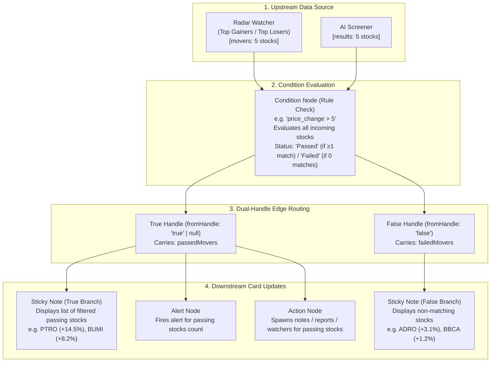

# 📋 Implementation Plan: Top Movers & Screener Condition Filter Engine

> **Plan Name:** `TOP_MOVERS_CONDITION_FILTER_PLAN.md`  
> **Status:** Ready for Review / Execution  
> **Target Subsystem:** Graph Engine (`src/server/services/graphEngine.ts`), DSL Evaluation, Canvas Node State Sync, and Unit Tests  
> **Estimated Scope:** 1 Core Service File, 2 Unit Test Suites

---

## 1. Problem Statement & Root Cause

### 1.1 The Bug
When a user connects a **Radar Watcher** (`Top Gainers` or `Top Losers`) or an **AI Natural Language Screener** to a **Condition / Rule Check** node on the Scriffle canvas:
- The Condition node stays in the `'idle'` status (displaying `"Waiting"` in the UI indefinitely).
- No downstream **Sticky Notes**, **Alerts**, or **Actions** receive updates or show the filtered companies.

### 1.2 Root Cause in `src/server/services/graphEngine.ts`

1. **Radar Watcher Flow:**
   In [`executeGraphForRadarWatcher`](file:///home/moke/Projects/scriffle/src/server/services/graphEngine.ts#L1148-L1153):
   ```typescript
   } else if (targetNode.type === 'condition') {
     // Evaluate condition for each mover and propagate
     for (const mover of movers) {
       await executeGraphForEvent(canvasId, mover);
     }
   }
   ```
   - `executeGraphForEvent` filters for single-symbol Watcher nodes (`cfg.symbol === mover.symbol`) and explicitly discards radar watchers (`isRadar => return false`).
   - Because no single-symbol watcher matches the radar mover, `matchingWatchers.length === 0` and `executeGraphForEvent` immediately exits without doing anything.
   - The Condition node (`targetNode`) is **never evaluated**, its `stateJson` is never updated (`status: 'idle'`), and its outgoing edges are never traversed.

2. **AI Screener Flow:**
   In [`executeGraphForScreener`](file:///home/moke/Projects/scriffle/src/server/services/graphEngine.ts#L1330-L1654):
   - There is no `targetNode.type === 'condition'` branch at all. If a Screener connects to a Condition node, it is completely ignored.

---

## 2. Expected Behavior & UX Specifications



### 2.1 Condition Node State & Visual Feedback
- **`status`**:
  - `'passed'` (Green outline + "Passed" badge) if `passedMovers.length > 0`.
  - `'failed'` (Red outline + "Failed" badge) if `passedMovers.length === 0`.
- **`stateJson` Metadata**:
  ```json
  {
    "status": "passed",
    "lastValue": { "symbol": "PTRO", "price_change": 14.5, "price": 18200 },
    "passedCount": 2,
    "totalCount": 5,
    "passedMovers": [...],
    "failedMovers": [...],
    "lastTriggeredAt": "14:32:05"
  }
  ```

### 2.2 Filtered Sticky Note Format
When connected to a Condition's `True` branch:
- **If stocks passed (`passedMovers.length > 0`):**
  ```text
  🚀 FILTERED TOP GAINERS (2/5 Passed)
  • Filter: price_change > 5
  • #1 PTRO: Rp 18,200 (+14.5%)
  • #2 BUMI: Rp 140 (+8.2%)
  • Updated: 14:32:05
  ```
- **If no stocks passed (`passedMovers.length === 0`):**
  ```text
  📊 RULE FILTER: "price_change > 5"
  • No companies met the condition (0/5 passed)
  • Evaluated: 5 top movers
  • Updated: 14:32:05
  ```

---

## 3. Technical Design & Architecture

### 3.1 Helper Functions in `graphEngine.ts`

#### `generateFilteredLeaderboardNoteContent`
```typescript
export function generateFilteredLeaderboardNoteContent(
  movers: MarketEvent[],
  rule: string,
  mode?: string,
  period?: string,
  totalEvaluated?: number,
  isPassedBranch: boolean = true
): string {
  const isGainer = mode === 'top_gainers' || mode === 'Top Gainers' || (movers[0] && movers[0].price_change >= 0);
  const icon = isPassedBranch ? (isGainer ? '🚀' : '🔻') : '⚖️';
  const categoryTitle = isGainer ? 'TOP GAINERS' : 'TOP LOSERS';
  const branchTitle = isPassedBranch ? `FILTERED ${categoryTitle}` : `NON-MATCHING ${categoryTitle}`;
  const countStr = totalEvaluated ? ` (${movers.length}/${totalEvaluated} ${isPassedBranch ? 'Passed' : 'Filtered'})` : ` (${movers.length} stocks)`;
  const periodStr = period ? ` [${period.toUpperCase()}]` : '';

  if (!movers || movers.length === 0) {
    return `📊 RULE FILTER: "${rule}"\n• No companies ${isPassedBranch ? 'passed' : 'failed'} the condition\n• Evaluated: ${totalEvaluated || 0} stocks\n• Updated: ${new Date().toLocaleTimeString()}`;
  }

  const rows = movers.map((m, idx) => {
    const rank = m.rank ? `#${m.rank}` : `#${idx + 1}`;
    const priceStr = m.price ? `Rp ${m.price.toLocaleString('id-ID')}` : 'N/A';
    const changeStr = `${m.price_change >= 0 ? '+' : ''}${m.price_change}%`;
    return `• ${rank} ${m.symbol}: ${priceStr} (${changeStr})`;
  });

  return `${icon} ${branchTitle}${countStr}${periodStr}\n• Rule: ${rule}\n${rows.join('\n')}\n• Updated: ${new Date().toLocaleTimeString()}`;
}
```

### 3.2 Recursive / Downstream Traversal for Filtered Lists
Create a dedicated traversal function `propagateFilteredMovers(canvas, conditionNode, passedMovers, failedMovers, options)`:

1. **Update Condition Node in SQLite:**
   - Write updated `stateJson` with `status: passedMovers.length > 0 ? 'passed' : 'failed'`.
   - Add condition node ID to `triggeredNodes`.
   - Log to Activity Feed: `Condition "${rule}" evaluated ${movers.length} stocks (${passedMovers.length} passed)`.

2. **Traverse Outgoing Edges:**
   - Edges with `fromHandle === 'true'` (or default `null`/`""`) receive `passedMovers`.
   - Edges with `fromHandle === 'false'` receive `failedMovers`.

3. **Handle Target Node Types:**
   - **`note`**:
     - Updates sticky note content using `generateFilteredLeaderboardNoteContent`.
     - Sets note status to `'passed'`.
   - **`alert`**:
     - Formats alert summary with number of passing stocks (and top passing stock).
     - Sends Discord alert payload if webhook is enabled.
   - **`action`**:
     - `create_note`: Spawns note cards for each passing company.
     - `fundamental_report`: Fetches brief & downloads HTML/PDF report for each passing company.
     - `create_watcher`: Spawns automated single-stock Watcher pipelines for passing stocks.
   - **`condition` (Chained Filters)**:
     - Allows piping into a second condition node (e.g. `price_change > 5` -> `volume > 50000000`) for multi-step filtering.

### 3.3 AI Screener Condition Filtering
In `executeGraphForScreener`:
- Map `ScreenerCompanyResult[]` to `MarketEvent[]` format:
  ```typescript
  const moverEvents: MarketEvent[] = results.map((c, idx) => ({
    symbol: c.symbol,
    name: c.company_name,
    price: c.price || 0,
    prevPrice: c.price || 0,
    price_change: c.price_change || 0,
    volume: c.volume || 0,
    avg_volume: 0,
    rank: idx + 1,
    timestamp: new Date().toLocaleTimeString(),
  }));
  ```
- Evaluate condition rule for each screener item, update condition node status, and propagate to downstream notes/alerts/actions.

---

## 4. Step-by-Step Implementation Tasks

| Task # | File | Action | Details |
|---|---|---|---|
| **Task 1** | `src/server/services/graphEngine.ts` | Add formatting helper | Add `generateFilteredLeaderboardNoteContent` supporting filtered counts, rules, and branch badges. |
| **Task 2** | `src/server/services/graphEngine.ts` | Implement Condition routing in `executeGraphForRadarWatcher` | Replace invalid `executeGraphForEvent` loop with direct evaluation of `movers` through `evaluateCondition`, updating `targetNode` (`condition`) state, and propagating downstream. |
| **Task 3** | `src/server/services/graphEngine.ts` | Implement Condition routing in `executeGraphForScreener` | Add `targetNode.type === 'condition'` branch evaluating screened stocks and routing to downstream branches. |
| **Task 4** | `src/__tests__/unit/conditionBranching.test.ts` | Add unit test suite | Add tests verifying Top Gainers / Losers condition filtering, True/False branching, and zero-match fallback. |
| **Task 5** | `src/__tests__/unit/leaderboard.test.ts` | Add unit test suite | Add tests verifying `generateFilteredLeaderboardNoteContent` formatting for passing, failing, and empty states. |

---

## 5. Verification Checklist

- [ ] Connect `Top Gainers` -> `Condition (price_change > 5)` -> `Sticky Note (True handle)`:
  - Condition card displays **`Passed`** status (green border).
  - Sticky note displays the filtered stocks meeting `price_change > 5`.
- [ ] Connect `Top Gainers` -> `Condition (price_change > 50)` (no stocks match):
  - Condition card displays **`Failed`** status (red border).
  - Sticky note displays clean `0/5 passed` message without crashing.
- [ ] Connect `Condition (False handle)` -> `Sticky Note`:
  - Sticky note displays the stocks that failed the condition.
- [ ] Connect `Top Losers` -> `Condition (price_change < -5)` -> `Sticky Note`:
  - Losers are properly filtered and formatted with 🔻 icons and negative percentages.
- [ ] Connect `AI Screener` -> `Condition` -> `Sticky Note`:
  - Screener results are properly filtered and updated on canvas.
- [ ] All existing 26 unit test suites continue passing with 100% green status.
