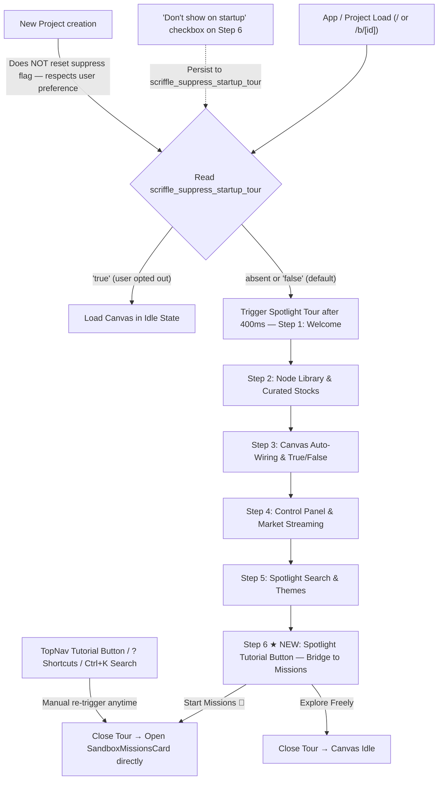

# 📋 Implementation Plan: Unified Onboarding Flow (Spotlight Tour ➔ Hands-On Tutorial) & Startup Settings

> **Feature Type:** Onboarding UX, Tour Triggering Architecture & User Guidance Flow
> **Status:** Revised — Ready for Implementation
> **Objective:** Ensure Scriffle reliably offers the onboarding experience upon every app load and new project creation (with an explicit *"Don't show on startup"* opt-out toggle), executes the strict **1. Spotlight Tour ➔ 2. Sandbox Tutorial** progression with a clean bridge at Step 6, and handles existing-user migration gracefully.

---

## 1. Root Cause Analysis & Problems Identified

Grounded in the actual source files:

1. **`OnboardingContext.tsx` — Tour never re-triggers after first skip/complete:**
   - Both `completeTour()` and `skipTour()` write `scriffle_onboarded_v1 = 'true'` to `localStorage`.
   - On reload, `hasCompleted` defaults to `true` before the client-side check runs (`useState<boolean>(true)`), then reads `completed === true` and silences the tour permanently — even for new project boards.

2. **No "Don't show on startup" opt-out:**
   - The context exposes no such preference. Users have zero control over startup behavior without manually clearing localStorage.
   - Closing the tour once = never seeing it again, with no way to restore default behaviour.

3. **`tourStepsConfig.ts` — Only 5 steps, no bridge to Sandbox Tutorial:**
   - The badge field is hardcoded as `"Step X of 5"` and there is no Step 6 targeting `[data-tour="tutorial-btn"]`.
   - The `TourCardPopover.tsx` fires a `scriffle:open-sandbox-tutorial` CustomEvent on the last step's "Start Missions" button — but this only works if the SandboxMissionsCard is listening and all components are mounted. Step 6 doesn't spotlight the Tutorial button before launching.

4. **`TopNav.tsx` — Tutorial button has no `data-tour` hook:**
   - The Tutorial button (lines 241–257) renders the `🎯 Tutorial` button correctly but has **no `data-tour="tutorial-btn"` attribute**, so the SVG cutout mask in `SpotlightOverlay.tsx` cannot isolate it.

5. **Missing per-project session reset:**
   - When a new project is created or switched via `ProjectSwitcherModal`, the old `scriffle_onboarded_v1 = 'true'` flag persists. New canvases silently open without any onboarding prompt.

6. **`onboarding.test.ts` — Tests are coupled to 5 steps:**
   - The test on line 7 asserts `TOUR_STEPS.length` to be `5`, and line 18 asserts each badge is `"Step X of 5"`. Both will fail after adding Step 6.

7. **Old vs new localStorage key migration not defined:**
   - The original plan introduces `scriffle_suppress_startup_tour` but doesn't address what to do with existing users who already have `scriffle_onboarded_v1 = 'true'`. Without a migration strategy, existing users would get the tour forced on them on next visit.

---

## 2. Proposed Solution & UX Architecture



---

## 3. Design Decisions & Rationale

### A. Checkbox moved to Step 6 (last step), not Step 1
The original plan placed *"Don't show on startup"* on the Welcome step. This is premature — the user hasn't seen any of the product yet and has no basis to decide. Placing it on Step 6 (after completing the full tour) gives users full context before opting out. This is consistent with how Figma, Notion, and Linear handle it.

### B. New Project does NOT force tour re-trigger
The original plan's mermaid diagram showed `New Project → Reset Session Flag → Trigger Tour`. This would annoy power users who explicitly opted out. The correct rule: **the `scriffle_suppress_startup_tour` flag is global and persists across all projects.** The tour only auto-launches on a fresh first-time visit (no suppress flag present at all).

### C. `scriffle:open-sandbox-tutorial` CustomEvent replaced with direct context call
The current `TourCardPopover.tsx` fires a `CustomEvent` to open the sandbox tutorial. This is fragile (depends on listener being mounted, no guarantee of timing). The improved flow passes `openTutorial` from `SandboxTutorialContext` as a prop or via context directly into `TourCardPopover` Step 6's "Start Missions" button handler.

### D. Migration rule for existing users
Users with `scriffle_onboarded_v1 = 'true'` in localStorage should NOT have the tour forced on them. On startup, if `scriffle_onboarded_v1 === 'true'` exists and `scriffle_suppress_startup_tour` is absent, **auto-write `scriffle_suppress_startup_tour = 'true'`** and remove the old key. This respects all prior dismissals and is a clean one-time migration.

---

## 4. New localStorage Schema

| Key | Type | Default | Description |
| :--- | :--- | :--- | :--- |
| `scriffle_suppress_startup_tour` | `'true' \| 'false'` | absent (= show tour) | When `'true'`, bypasses auto-launch on every page load. Set by *"Don't show on startup"* checkbox on Step 6. |
| `scriffle_tour_step` | `number` | `0` | Active step for `ResumeTourPill` resume functionality. |
| `scriffle_sandbox_missions_v1` | `Record<string, Progress>` | `{}` | Managed by `SandboxTutorialContext` (already implemented). |
| ~~`scriffle_onboarded_v1`~~ | — | — | **Deprecated.** Migrated to `scriffle_suppress_startup_tour` on first load. |

---

## 5. Updated 6-Step Spotlight Tour (`tourStepsConfig.ts`)

| # | Step ID | Title | Target Selector | Placement | Badge |
|---|---|---|---|---|---|
| 1 | `welcome` | Welcome to Scriffle | *(none — center modal)* | `center` | Step 1 of 6 |
| 2 | `toolbar-and-search` | Node Library & Curated Stocks | `[data-tour="nav-toolbar"]` | `top` | Step 2 of 6 |
| 3 | `connections-and-logic` | Auto-Wiring & Branching Rules | `[data-tour="market-canvas"]` | `center` | Step 3 of 6 |
| 4 | `simulation-and-stream` | Live Engine & Market Stream | `[data-tour="simulation-bar"]` | `right` | Step 4 of 6 |
| 5 | `superpowers-and-shortcuts` | Spotlight Search & Themes | `[data-tour="top-nav-actions"]` | `bottom` | Step 5 of 6 |
| 6 ★ | `tutorial-bridge` | Ready to Build? | `[data-tour="tutorial-btn"]` | `bottom` | Step 6 of 6 |

**Step 6 spec:**
- **Title:** `"Ready to Build?"`
- **Description:** `"Take the 6-mission guided challenge to build a real pipeline with research files, custom rules, and live simulations directly on this canvas."`
- **Icon:** `target_line`
- **Footer:** Includes the *"Don't show on startup"* checkbox (see Section 3A)
- **Buttons:**
  - `[Start Hands-On Missions 🎯]` (primary blue) → calls `openTutorial()` from `SandboxTutorialContext`, then calls `completeTour()`
  - `[Explore Freely]` (secondary neutral) → calls `completeTour()`

---

## 6. Detailed Implementation — Files to Change

### 1. `src/context/OnboardingContext.tsx`

**Changes:**
- Remove `ONBOARDING_STORAGE_KEY = 'scriffle_onboarded_v1'`.
- Add `SUPPRESS_KEY = 'scriffle_suppress_startup_tour'`.
- Add `dontShowAgain: boolean` state + `setDontShowAgain(val: boolean)` exported in context type.
- **Migration logic in startup `useEffect`:**
  ```typescript
  // One-time migration: respect users who previously dismissed the tour
  const legacyCompleted = localStorage.getItem('scriffle_onboarded_v1');
  const suppress = localStorage.getItem('scriffle_suppress_startup_tour');
  if (legacyCompleted === 'true' && suppress === null) {
    localStorage.setItem('scriffle_suppress_startup_tour', 'true');
    localStorage.removeItem('scriffle_onboarded_v1');
  }
  ```
- **Auto-trigger logic:**
  ```typescript
  const suppressed = localStorage.getItem('scriffle_suppress_startup_tour') === 'true';
  if (!suppressed) {
    // Start tour after 400ms delay (existing timer pattern)
  }
  ```
- `completeTour()` and `skipTour()` must **no longer write** `scriffle_onboarded_v1`. They write `scriffle_tour_step` for resume, nothing else.
- `setDontShowAgain` writes `scriffle_suppress_startup_tour` to localStorage and updates state.

### 2. `src/components/onboarding/tourStepsConfig.ts`

**Changes:**
- Add Step 6 object to `TOUR_STEPS` array:
  ```typescript
  {
    id: 'tutorial-bridge',
    title: 'Ready to Build?',
    description: 'Take the 6-mission guided challenge to build a real pipeline with research files, custom rules, and live simulations directly on this canvas.',
    targetSelector: '[data-tour="tutorial-btn"]',
    placement: 'bottom',
    badge: 'Step 6 of 6',
    icon: 'target_line',
  }
  ```
- Update all existing badges from `"Step X of 5"` → `"Step X of 6"`.

### 3. `src/components/onboarding/TourCardPopover.tsx`

**Changes:**
- Consume `dontShowAgain` and `setDontShowAgain` from `useOnboarding()`.
- Consume `openTutorial` from `useSandboxTutorial()` (already exists in `SandboxTutorialContext`).
- **On Step 6 footer only:** render the *"Don't show on startup"* checkbox:
  ```tsx
  {isLastStep && (
    <label className="flex items-center gap-2 text-xs cursor-pointer select-none">
      <input
        type="checkbox"
        checked={dontShowAgain}
        onChange={(e) => setDontShowAgain(e.target.checked)}
        className="rounded accent-[#0050FF]"
      />
      <span>Don't show on startup</span>
    </label>
  )}
  ```
- **Replace the Step 6 "Start Missions" button handler** — remove the fragile `CustomEvent` dispatch. Instead:
  ```tsx
  onClick={() => {
    completeTour();
    openTutorial(); // direct call from SandboxTutorialContext
  }}
  ```
- **"Explore Freely" button** on last step calls only `completeTour()`.

### 4. `src/components/controls/TopNav.tsx`

**Change:** Add `data-tour="tutorial-btn"` to the Tutorial button element (line 242–257):
```tsx
<button
  type="button"
  data-tour="tutorial-btn"   {/* ← ADD THIS */}
  onClick={onStartTutorial}
  ...
>
```

### 5. `src/__tests__/unit/onboarding.test.ts`

**Changes:**
- Update `TOUR_STEPS.length` assertion from `5` → `6`.
- Update all badge format assertions from `"Step X of 5"` → `"Step X of 6"`.
- Add test: Step 6 has `id === 'tutorial-bridge'`, `targetSelector === '[data-tour="tutorial-btn"]'`, `placement === 'bottom'`.
- Add test: `scriffle_suppress_startup_tour` key name is correct (constant export or string check).
- Add test: startup suppression logic — when suppress key is `'true'`, tour should not auto-start.
- Add test: migration from legacy `scriffle_onboarded_v1` key sets `scriffle_suppress_startup_tour = 'true'` and removes old key.

---

## 7. What Does NOT Change

- `ResumeTourPill.tsx` — no changes needed; it reads `resumeStepIndex` from context which still works.
- `SpotlightOverlay.tsx` — no changes needed; it already handles arbitrary `targetSelector` via `getBoundingClientRect()`.
- `SandboxTutorialContext.tsx`, `SandboxMissionsCard.tsx`, `sandboxMissionsConfig.ts` — all fully implemented and untouched.
- `ProjectSwitcherModal.tsx` — no changes; new project creation does not re-trigger the tour.
- `TopNav.tsx` prop `onStartTutorial` — already wired; only the `data-tour` attribute is missing.

---

## 8. User Experience Walkthrough (Final)

1. **First-time user opens Scriffle:**
   - `scriffle_suppress_startup_tour` is absent → tour auto-starts after 400ms.
   - Steps 1–5 spotlight the toolbar, canvas, control panel, and theme actions.

2. **User reaches Step 6:**
   - SVG cutout mask zooms to the `[🎯 Tutorial]` button in TopNav.
   - Popover invites: *"Ready to Build? Take the 6-mission guided challenge…"*
   - Footer shows *"Don't show on startup"* checkbox (unchecked by default).

3. **User clicks "Start Hands-On Missions":**
   - `completeTour()` closes the overlay.
   - `openTutorial()` opens `SandboxMissionsCard` at top-left with Mission 01 active.

4. **User checks "Don't show on startup" before clicking:**
   - `scriffle_suppress_startup_tour = 'true'` is written immediately on checkbox change.
   - Future page loads, tab refreshes, and `/b/[id]` routes open canvas directly without any prompt.

5. **Returning user (previously dismissed with old key):**
   - Migration runs on first load: `scriffle_onboarded_v1 → scriffle_suppress_startup_tour`.
   - No unexpected re-trigger. Experience is seamless.

6. **Manual re-trigger anytime:**
   - TopNav `[🎯 Tutorial]` button → opens `SandboxMissionsCard` directly.
   - Spotlight Search (`Ctrl+K`) → "Start Hands-On Missions" command.
   - `?` Shortcuts modal → "Start Tour" / "Open Tutorial" actions.

---

## 9. Verification & Validation

1. **Unit Tests:** Run `bun test` — expect all 21 suites (215 tests) to remain 100% green after updating `onboarding.test.ts`.
2. **Build Check:** Run `bun run build` to confirm zero TypeScript or Turbopack errors.
3. **Manual Flow:**
   - Clear localStorage → reload → confirm tour starts automatically at Step 1.
   - Advance to Step 6 → confirm spotlight focuses the `[🎯 Tutorial]` button.
   - Click "Start Missions" → confirm `SandboxMissionsCard` opens and tour overlay is gone.
   - Check "Don't show on startup" on Step 6 → reload → confirm canvas opens silently.
   - Set `scriffle_onboarded_v1 = 'true'` manually → reload → confirm migration runs and tour does NOT start.
   - Open TopNav Tutorial button manually → confirm `SandboxMissionsCard` opens from idle state.
