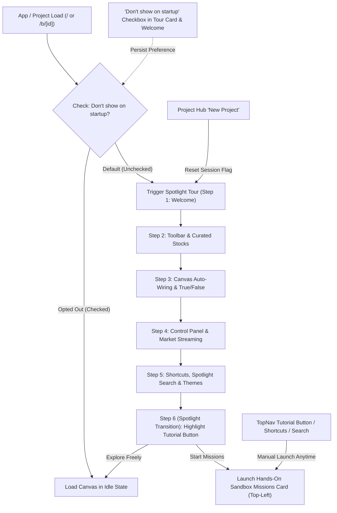

# 📋 Implementation Plan: Unified Onboarding Flow (Spotlight Tour ➔ Hands-On Tutorial) & Startup Settings

> **Feature Type:** Onboarding UX, Tour Triggering Architecture & User Guidance Flow  
> **Status:** Proposed Implementation Plan  
> **Objective:** Ensure Scriffle reliably offers the onboarding experience upon every app load and new project creation (with an explicit *"Don't show on startup"* opt-out toggle), executes the strict **1. Spotlight Tour ➔ 2. Sandbox Tutorial** progression, and spotlights the Tutorial action card/button at the transition.

---

## 1. Root Cause Analysis & Problems Identified

1. **Why Spotlight Tour Stopped Auto-Triggering:**
   - In [`OnboardingContext.tsx`](file:///home/abzolute/Projects/hackathon/src/context/OnboardingContext.tsx), `hasCompleted` was permanently stored in `localStorage.setItem('scriffle_onboarded_v1', 'true')` as soon as the user clicked *Skip* or finished once.
   - On subsequent visits, tab refreshes, or project switching (`/b/[id]`), the context read `completed === true` and silenced the tour completely without offering it to new project sessions.
2. **Missing Opt-Out ("Don't show on startup") Checkbox:**
   - Users had no way to control startup behavior. The system should default to offering the tour/tutorial on session start unless the user explicitly checks *"Don't show this on startup"*.
3. **Missing Seamless Transition & Spotlight on Tutorial:**
   - In [`tourStepsConfig.ts`](file:///home/abzolute/Projects/hackathon/src/components/onboarding/tourStepsConfig.ts), Step 5 focused on general shortcuts. It did not spotlight the newly added **Tutorial launcher button** (`[data-tour="tutorial-btn"]`) or seamlessly open the floating **Sandbox Missions Card** as Step 6 / Transition.
4. **Missing Per-Project Session Initialization:**
   - When switching or creating a new project board (`ProjectSwitcherModal` / New File), the user was not offered the tour/tutorial for the new canvas.

---

## 2. Proposed Solution & UX Architecture

---

## 3. Detailed Technical Specifications

### A. Persistent Startup Preferences (`localStorage` Schema)

We will separate **"Seen in current session"** from **"Permanently disabled on startup"**:

| Storage Key | Type | Default | Description |
| :--- | :--- | :--- | :--- |
| `scriffle_suppress_startup_tour` | `boolean` (`'true'` \| `'false'`) | `false` | When `'true'`, bypasses auto-launch on page load. Controlled by *"Don't show on startup"* checkbox. |
| `scriffle_tour_step` | `number` | `0` | Active step for resume pill. |
| `scriffle_sandbox_progress_v1` | `Record<string, Progress>` | `{}` | Live task completion tracking for the 6 sandbox missions. |

### B. Updated 6-Step Spotlight Tour Flow (`tourStepsConfig.ts`)

Add an explicit **Step 6 Spotlight Transition** that directly illuminates the Tutorial Button:

1. **Step 1 (Welcome)**: Modal center card introducing Scriffle. Features *"Don't show on startup"* toggle checkbox at bottom.
2. **Step 2 (Toolbar & Curated Stocks)**: Highlights `[data-tour="nav-toolbar"]` (150+ IDX tickers, File cards, Screeners).
3. **Step 3 (Auto-Wiring & Branching)**: Highlights `[data-tour="market-canvas"]` (`[+]` handles, True/False logic).
4. **Step 4 (Live Stream & Engine)**: Highlights `[data-tour="simulation-bar"]` (Do Once, Stream Data).
5. **Step 5 (Spotlight Search & Themes)**: Highlights `[data-tour="top-nav-actions"]` (`Ctrl+K`, Theme Switcher).
6. **Step 6 (Interactive Hands-On Sandbox Tutorial — NEW)**:
   - **Target**: `[data-tour="tutorial-btn"]` (The Tutorial button in `TopNav.tsx`).
   - **Title**: *"Ready to Build? Hands-On Sandbox Tutorial"*.
   - **Description**: *"Take the 6-mission guided challenge to build a real pipeline with research files, custom rules, and live simulations directly on this canvas."*
   - **Action Buttons**:
     - `[Start Hands-On Missions 🎯]` (Primary electric blue button) $\rightarrow$ opens `SandboxMissionsCard` and focuses Mission 1.
     - `[Explore Freely]` (Secondary neutral button) $\rightarrow$ closes tour.

---

## 4. Implementation Steps & Files to Update

### 1. `src/context/OnboardingContext.tsx`
- Add `dontShowAgain: boolean` state initialized from `localStorage.getItem('scriffle_suppress_startup_tour') === 'true'`.
- Add `setDontShowAgain(val: boolean)` function to update state and `localStorage`.
- Update auto-trigger `useEffect`: On mount, if `!dontShowAgain`, start tour after a clean 400ms delay.
- Add project-switch awareness: when route or canvas ID changes, if not suppressed, prompt or launch onboarding.

### 2. `src/components/onboarding/tourStepsConfig.ts`
- Extend `TOUR_STEPS` to 6 steps, dedicating Step 6 to highlighting `[data-tour="tutorial-btn"]` and launching the hands-on tutorial.
- Update Step 5 to focus on Spotlight Search (`Ctrl+K`) and Theme Switcher.

### 3. `src/components/onboarding/TourCardPopover.tsx`
- Add a tactile checkbox: `[ ] Don't show on startup` in the footer/body of the popover card.
- On Step 6 (final step), wire the primary button *"Start Hands-On Missions"* to automatically trigger `openTutorial()` in `SandboxTutorialContext` and dismiss the spotlight.

### 4. `src/components/controls/TopNav.tsx`
- Add `data-tour="tutorial-btn"` to the Tutorial button container for precise SVG cutout spotlight masking.

### 5. `src/components/controls/ProjectSwitcherModal.tsx` & New Board Creation
- When creating a "New File" or switching to a new board, ensure tour/tutorial can be restarted or offered cleanly.

### 6. `src/__tests__/unit/onboarding.test.ts`
- Update unit tests to verify:
  - 6 tour steps including the Tutorial Spotlight transition.
  - Presence of `[data-tour="tutorial-btn"]` selector.
  - Startup suppression preference toggling.

---

## 5. User Experience Walkthrough

1. **User opens Scriffle (or creates a New Board)**:
   - Spotlight Tour opens with Step 1 (Welcome).
   - Bottom shows `[ ] Don't show on startup` checkbox (unchecked by default).
2. **User advances through Steps 1 ➔ 5**:
   - Spotlights toolbar, canvas, simulation bar, and top actions.
3. **User reaches Step 6**:
   - The spotlight mask narrows specifically over the **`[🎯 Tutorial]`** button in TopNav.
   - Popover card invites user: *"Ready to Build? Take the 6-Mission Sandbox Challenge"*.
4. **User clicks "Start Hands-On Missions"**:
   - Spotlight overlay fades out.
   - Floating **Sandbox Missions Card** opens at top-left with Mission 01 active.
5. **If user checked "Don't show on startup"**:
   - Preference is saved; future visits go straight to canvas without interrupting the presenter.
   - User can still launch Tour or Tutorial anytime via TopNav `[Tutorial]` or `[?]` Shortcuts modal.

---

## 6. Verification & Validation Plan

1. **Unit Test Suite**: Run `bun test` to ensure all 21 test suites (215+ tests) remain 100% green.
2. **Build Check**: Run `bun run build` to guarantee zero Turbopack/TypeScript errors.
3. **Manual Flow Verification**:
   - Test initial load $\rightarrow$ Spotlight Tour $\rightarrow$ Step 6 Spotlight on Tutorial button $\rightarrow$ Start Missions $\rightarrow$ Missions Card opens.
   - Test checkbox toggle $\rightarrow$ reload page $\rightarrow$ confirm startup suppression.
   - Test manual re-trigger from TopNav and Shortcuts modal.
