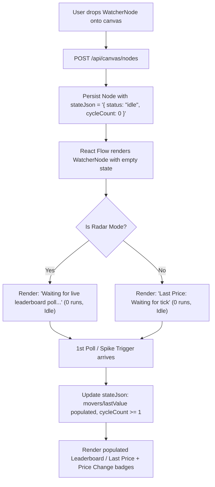

# 📋 Implementation Plan: Watcher Initial State Cleanliness (Rank 4)

## 1. Problem Statement & Motivation
Currently, when a new Watcher node is added to the canvas (either a single ticker like `BBCA` or a Radar Leaderboard node like `Top Gainers` / `Top Losers`), or when a `.scriffle` canvas without prior run states is restored:
1. **Radar Watchers (`Top Gainers` / `Top Losers`)**:
   - `WatcherNode.tsx` has a fallback: `fallbackMovers = isGainers ? MOCK_TOP_GAINERS : MOCK_TOP_LOSERS`. Even when `state.movers` is empty, it immediately renders the mock list (`JECX`, `AGII`, `MPRO`, etc.).
   - `src/app/api/canvas/nodes/route.ts` explicitly seeds new radar nodes with `MOCK_TOP_GAINERS` / `MOCK_TOP_LOSERS`.
   - `src/app/api/canvas/restore/route.ts` injects `MOCK_TOP_GAINERS` / `MOCK_TOP_LOSERS` if `cleanState.movers` is empty.
   - The UI placeholder `"Waiting for live leaderboard poll..."` is unreachable.
2. **Single Ticker Watchers (`BBCA`, `TLKM`, etc.)**:
   - Fresh single-stock watchers should display `"Waiting for tick"` under **Last Price** and omit the **Price Change** badge until the first live or mock market tick arrives.

---

## 2. Target UX & Visual State Specifications

### A. Radar Watcher (`mode: 'top_gainers' | 'top_losers'`)
- **Initial State (`cycleCount === 0` and `!state.movers?.length`):**
  - Card header: Icon, `Top 5 Gainers (1D)` or `Top 5 Losers (1D)`, Title `Top Gainers Radar` or `Top Losers Radar`, Badge `0 runs`.
  - Body container: Displays clean centered placeholder:
    ```
    Waiting for live leaderboard poll...
    ```
  - Footer: `Poll: 300s` | `Idle`
- **After 1st Poll or Trigger (`cycleCount >= 1` and `state.movers.length > 0`):**
  - Renders the ranked list (`#1`, `#2`, `#3`... with symbol, company name, price in IDR, and `% move` badge).
  - Badge updates to `⚡ 1 run` (or `⚡ N runs`).
  - Footer updates to `Updated <timestamp>`.

### B. Single Ticker Watcher (`symbol: 'BBCA'`, etc.)
- **Initial State (`cycleCount === 0` and `!state.lastValue?.price`):**
  - Card header: Icon, `Market Watcher`, Title `BBCA`, Badge `0 runs`.
  - Body container:
    - **Last Price**: `"Waiting for tick"`
    - **Price Change**: Not rendered (clean single-row layout).
  - Footer: `Poll: 300s` | `Idle`
- **After 1st Poll or Trigger (`cycleCount >= 1` and `state.lastValue?.price`):**
  - **Last Price**: `Rp 10,250`
  - **Price Change**: `▲ +2.5%` or `▼ -1.2%`
  - Badge updates to `⚡ 1 run` (or `⚡ N runs`).
  - Footer updates to `Updated <timestamp>`.

---

## 3. Architecture & Code Changes



---

## 4. File Modification Breakdown

### 1. `src/components/canvas/nodes/WatcherNode.tsx`
- Removed the eager fallback assignment in `movers`.
- Kept the clean `"Waiting for live leaderboard poll..."` fallback block when `movers.length === 0`.
- Ensured single ticker view renders cleanly when `lastVal.price` is not yet available and `priceChange === null`.

### 2. `src/app/api/canvas/nodes/route.ts`
- Removed mock array injection on node creation.
- Initial state is set strictly to `{ status: 'idle', cycleCount: 0 }`.

### 3. `src/app/api/canvas/restore/route.ts`
- Removed auto-injection of `MOCK_TOP_GAINERS` / `MOCK_TOP_LOSERS` into `cleanState.movers` when restoring `.scriffle` files.
- Preserved existing `state.movers` if present in export; otherwise kept empty.

### 4. `src/__tests__/unit/watcherInitialState.test.ts`
- Added unit test suite covering initial state contracts, empty mover lists, and dynamic population after poll ticks.
