# Project Demo Plan: IDX Macro & Alpha Intelligence Dashboard

## 1. Overview & Concept
**Project Name:** `IDX Macro & Alpha Intelligence Dashboard` (`idx_macro_alpha_intelligence.scriffle`)  
**Purpose:** A comprehensive, multi-pillar research canvas demonstrating how Scriffle empowers an IDX market strategist / hedge fund analyst to combine real-time Sectors API watcher streams, dynamic multi-tier conditions, automated note generation, downstream action dispatching, proactive UI alerts, and strategic brainstorming sticky notes into a unified visual workflow.

---

## 2. Sectors API v2 Integration Mapping
Based on `ENDPOINTS.md`, this demo dashboard models key IDX market behaviors across 4 primary analytical pillars:

1. **Banking Hegemony & Credit Cycle Hub (BBCA, BBRI)**
   - *API Endpoints*: `/v2/daily/{symbol}/`, `/v2/company/report/{symbol}/`, `/v2/foreign-flow/{symbol}/`
   - *Logic*: Monitors blue-chip bank liquidity breakouts. If BBCA surges with elevated volume, generates a bullish thesis note, triggers an immediate desktop alert, and automatically spawns a watcher for peer bank BBRI to catch rotation lags.

2. **Energy & Commodity Supercycle Radar (ADRO, PTBA)**
   - *API Endpoints*: `/v2/daily/{symbol}/`, `/v2/companies/top-changes/`, `/v2/subsector/report/oil-gas-coal/`
   - *Logic*: Tracks commodity swing pullbacks and dividend play momentum. Multi-variable condition checks price drops vs rebound triggers to alert for dividend yield entry zones.

3. **Digital Economy & Telco Turnaround Radar (TLKM, GOTO)**
   - *API Endpoints*: `/v2/daily/{symbol}/`, `/v2/most-traded/`, `/v2/broker-summary/{symbol}/top/`
   - *Logic*: Detects sudden volume spikes and turnaround reversals. Auto-generates actionable trade journal notes with live macro timestamps.

4. **Macro Brainstorming & Strategic Working Canvas**
   - *Components*: Multi-colored sticky notes (`mint`, `yellow`, `pink`, `purple`, `blue`) categorizing:
     - **Working Components**: Live signal routing instructions and execution protocols.
     - **Brainstorming Notes**: Fundamental hypotheses (BI rate trajectory, foreign inflow trends, commodity index correlation).
     - **User Layout Placeholders**: Dedicated canvas zones demarcated for the user's custom images (charts, company report screenshots) and reaction stickers.

---

## 3. Node Architecture & Layout Map

```mermaid
graph TD
    subgraph Pillar 1: Banking Hegemony
        W_BBCA[Watcher: BBCA] --> C_BBCA_Surge[Condition: price_change > 3.5 AND volume > 15M]
        W_BBCA --> C_BBCA_Dip[Condition: price_change < -2.0]
        C_BBCA_Surge --> A_BBCA_Alert[Alert: UI Toast - BBCA Breakout]
        C_BBCA_Surge --> Act_BBCA_Note[Action: create_note - Institutional Buy Note]
        Act_BBCA_Note --> Act_Spawn_BBRI[Action: create_watcher - BBRI Peer]
        C_BBCA_Dip --> Note_BBCA_Support[Sticky Note: Defense Support Level]
    end

    subgraph Pillar 2: Energy & Coal Yield
        W_ADRO[Watcher: ADRO] --> C_ADRO_Rebound[Condition: price_change > 4.0]
        C_ADRO_Rebound --> A_ADRO_Alert[Alert: UI Toast - Coal Dividend Rally]
        C_ADRO_Rebound --> Act_ADRO_Note[Action: create_note - Coal Cash Flow Log]
    end

    subgraph Pillar 3: Telco & Rebound
        W_TLKM[Watcher: TLKM] --> C_TLKM_Break[Condition: price_change > 2.0]
        C_TLKM_Break --> A_TLKM_Alert[Alert: UI Toast - Telco Turnaround]
        C_TLKM_Break --> Act_TLKM_Note[Action: create_note - Value Play Note]
    end

    subgraph Brainstorming & Macro
        Note_Macro1[Sticky Note: BI Rate Decision Outlook]
        Note_Macro2[Sticky Note: Foreign Flow Liquidity Matrix]
        Note_Macro3[Sticky Note: Target Price & Portfolio Sizing]
    end
```

---

## 4. Deliverables
1. `project_demo_plan.md` in workspace.
2. `presets/idx_macro_alpha_intelligence.scriffle`
